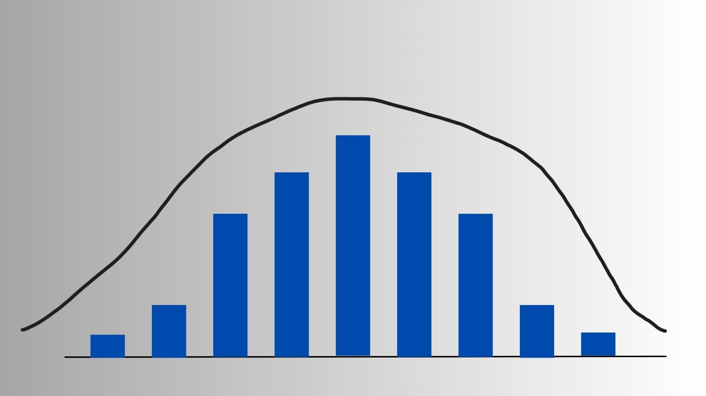

A Estatística Não-Paramétrica é uma abordagem de análise estatística que **não assume uma forma específica de distribuição para os dados**. Em contraste com a Estatística Paramétrica, que depende de pressupostos rígidos, como normalidade dos dados e homogeneidade de variâncias, os métodos não paramétricos são mais **flexíveis** e **robustos**, especialmente úteis quando os dados são ordinais, categóricos ou em pequenas amostras.

Enquanto a estatística paramétrica busca **estimar parâmetros** de distribuições conhecidas (como média e variância na normal), a não-paramétrica utiliza principalmente **ordens, rankings e frequências**, evitando suposições rígidas.

#### **Vantagens**

-   Pode ser aplicada em situações com **dados não normais** ou com **pequenas amostras**;

-   **Menor sensibilidade a outliers**;

-   Ideal quando **não se conhece a distribuição populacional**.

# Importação

``` python
import numpy as np
import pandas as pd
from scipy.stats import mannwhitneyu, wilcoxon, kruskal, friedmanchisquare, spearmanr # Adicionadas funções
# from scipy.stats import chisquare, kstest # Removido se não usado ou manter se necessário
```

# Teste U de Mann–Whitney

O **Teste U de Mann–Whitney**, também conhecido como **teste de Wilcoxon para duas amostras independentes**, é uma alternativa **não paramétrica** ao teste t de Student. Ele permite verificar se duas amostras independentes provêm da mesma população quanto à **mediana**, **sem pressupor normalidade**.

Esse teste é particularmente útil quando:

-   Os dados não seguem distribuição normal;
-   As variâncias são diferentes;
-   As variáveis são ordinais ou contínuas, mas não podem ser modeladas parametrizadamente.

## Hipóteses

Queremos testar se duas populações independentes têm **a mesma mediana**.

-   **Hipótese nula**: $H_0$: as distribuições de $X$ e $Y$ são iguais, ou seja, $md_X = md_Y$;

-   **Hipótese alternativa**: $H_1$: as distribuições são diferentes, ou seja, $md_X \neq md_Y$ (bilateral) ou $md_X > md_Y$ / $md_X < md_Y$ (unilateral).

## Metodologia

**Passo 1:** Combine as duas amostras e ordene os valores em ordem crescente.\
**Passo 2:** Atribua postos aos dados combinados. Em caso de empates, atribua a média dos postos.\
**Passo 3:** Calcule a soma dos postos do grupo $X$ ($R_X$) e do grupo $Y$ ($R_Y$).\
**Passo 4:** Calcule as estatísticas de Mann–Whitney:

-   $U_X = R_X - \dfrac{n_X(n_X + 1)}{2}$
-   $U_Y = R_Y - \dfrac{n_Y(n_Y + 1)}{2}$
-   $U = \min(U_X, U_Y)$

**Passo 5:** Compare o valor de $U$ com o valor crítico tabelado (ou use o valor-$p$ calculado).

------------------------------------------------------------------------

## Exemplo

**Comparação entre marcas A e B de fertilizante no crescimento de plantas:**

Marca A ($n_1 = 6$): 78, 85, 83, 74, 88, 90\
Marca B ($n_2 = 7$): 82, 79, 76, 81, 77, 80, 78

Testar:

$H_0: md_X = md_Y \quad \text{vs} \quad H_1: md_X \neq md_Y$

``` python
# Imports já feitos na seção #Importação

marca_A = np.array([78, 85, 83, 74, 88, 90]) 
marca_B = np.array([82, 79, 76, 81, 77, 80, 78])

stat, p_valor = mannwhitneyu(marca_A, marca_B, alternative='two-sided') 
print(f"Estatística U = {stat}, Valor-p = {p_valor:.4f}")
```

# Teste de Wilcoxon (Postos com Sinais)

O **Teste de Wilcoxon para Postos com Sinais** é uma alternativa **não paramétrica** ao teste t pareado. Ele é utilizado para comparar **duas amostras relacionadas ou pareadas**, ou para testar se a **mediana de uma única amostra é igual a um valor específico**, sem assumir normalidade das diferenças.

Este teste é útil quando:

-   Os dados são pareados (e.g., antes e depois de um tratamento).
-   As diferenças entre os pares não seguem uma distribuição normal.
-   Queremos testar a mediana de uma amostra contra um valor hipotético ($m_0$).

## Hipóteses (Para uma amostra)

Queremos testar se a mediana populacional ($md$) é igual a um valor $m_0$.

-   **Hipótese nula**: $H_0: md = m_0$
-   **Hipótese alternativa**: $H_1: md \ne m_0$ (bilateral) ou $md > m_0$ / $md < m_0$ (unilateral).

## Metodologia (Para uma amostra)

**Passo 1:** Calcule as diferenças $d_i = x_i - m_0$ para cada observação $x_i$. **Passo 2:** Ignore as diferenças $d_i = 0$. **Passo 3:** Calcule os valores absolutos das diferenças não nulas, $|d_i|$. **Passo 4:** Ordene os $|d_i|$ em ordem crescente e atribua postos (ranks). Em caso de empates, use a média dos postos. **Passo 5:** Reatribua os sinais originais das diferenças $d_i$ aos postos correspondentes. **Passo 6:** Calcule a soma dos postos positivos ($W^+$) e a soma dos valores absolutos dos postos negativos ($W^-$). **Passo 7:** A estatística do teste é $W = \min(W^+, W^-)$. **Passo 8:** Compare $W$ com o valor crítico tabelado (ou use o valor-$p$).

------------------------------------------------------------------------

## Exemplo (Para uma amostra)

**Teste da mediana de uma amostra:**

Amostra de tempos de reação (em segundos): 88, 82, 87, 68, 106, 60, 97. Queremos testar se a mediana do tempo de reação é igual a 70 segundos.

Testar:

$$
H_0: md = 70 \quad \text{vs} \quad H_1: md \ne 70
$$

``` python
# Imports já feitos na seção #Importação

x = np.array([88, 82, 87, 68, 106, 60, 97])
m0 = 70

# O teste de Wilcoxon em scipy.stats pode ser usado diretamente
# passando a amostra 'x' e o valor 'm0' (ou as diferenças x - m0)
# Nota: A implementação padrão testa se a mediana da *diferença* é zero.
# Para testar H0: md = m0, passamos x - m0.
diferencas = x - m0

# A função wilcoxon por padrão faz o teste bilateral (alternative='two-sided')
stat, p_valor = wilcoxon(diferencas)
print(f"Estatística W = {stat}, Valor-p = {p_valor:.4f}")

# Interpretação:
alpha = 0.05
if p_valor < alpha:
    print(f"Com valor-p = {p_valor:.4f} < {alpha}, rejeitamos H0.")
    print("Há evidência estatística para sugerir que a mediana do tempo de reação é diferente de 70 segundos.")
else:
    print(f"Com valor-p = {p_valor:.4f} >= {alpha}, não rejeitamos H0.")
    print("Não há evidência estatística suficiente para sugerir que a mediana do tempo de reação é diferente de 70 segundos.")
```

**Resultado no Exemplo**: Com W = 3 e valor-p = 0.0625 (calculado pela função `wilcoxon`), se usarmos $\alpha = 0.10$, rejeitaríamos $H_0$. Se usarmos $\alpha = 0.05$, não rejeitaríamos $H_0$. A interpretação depende do nível de significância escolhido.

### Considerações Finais

-   O teste de Wilcoxon é mais poderoso que o teste do sinal quando as diferenças são aproximadamente simétricas.
-   Para amostras pareadas $(x_i, y_i)$, o teste é aplicado às diferenças $d_i = x_i - y_i$, testando $H_0: md_{diferença} = 0$.

# Teste de Kruskal-Wallis

O **Teste de Kruskal-Wallis** é uma extensão não paramétrica do teste U de Mann-Whitney e uma alternativa à Análise de Variância (ANOVA) de um fator. Ele é utilizado para comparar as **medianas de três ou mais grupos independentes**, verificando se pelo menos um dos grupos difere dos demais em termos de localização central, sem assumir a normalidade dos dados.

Este teste é apropriado quando:

-   Queremos comparar três ou mais grupos independentes.
-   Os dados não seguem uma distribuição normal dentro de cada grupo.
-   As variâncias entre os grupos não são necessariamente homogêneas (embora formas de distribuição semelhantes sejam um pressuposto implícito para interpretar a diferença como sendo nas medianas).
-   Os dados são pelo menos ordinais.

## Hipóteses

Queremos testar se as medianas de $k$ populações independentes são iguais.

-   **Hipótese nula**: $H_0$: As medianas de todas as $k$ populações são iguais ($md_1 = md_2 = ... = md_k$).
-   **Hipótese alternativa**: $H_1$: Pelo menos uma mediana populacional é diferente das outras.

## Metodologia

**Passo 1:** Combine todas as observações dos $k$ grupos em um único conjunto de dados. Seja $N$ o número total de observações ($N = n_1 + n_2 + ... + n_k$). **Passo 2:** Ordene todas as $N$ observações em ordem crescente e atribua postos (ranks) de 1 a $N$. Em caso de empates, atribua a média dos postos que seriam ocupados. **Passo 3:** Calcule a soma dos postos para cada um dos $k$ grupos. Seja $R_i$ a soma dos postos para o grupo $i$. **Passo 4:** Calcule a estatística de teste $H$: $$
H = \frac{12}{N(N+1)} \sum_{i=1}^{k} \frac{R_i^2}{n_i} - 3(N+1)
$$ Onde $n_i$ é o tamanho da amostra do grupo $i$. *(Opcional: Se houver muitos empates, uma correção para* $H$ pode ser aplicada, mas geralmente tem pouco efeito a menos que a proporção de empates seja grande). **Passo 5:** Compare a estatística $H$ com o valor crítico da distribuição Qui-quadrado ($\chi^2$) com $k-1$ graus de liberdade, para um nível de significância $\alpha$ escolhido. Alternativamente, calcule o valor-$p$ associado a $H$. **Passo 6:** Se $H$ for maior que o valor crítico (ou se o valor-$p < \alpha$), rejeite $H_0$. Isso sugere que há uma diferença estatisticamente significativa entre as medianas de pelo menos dois grupos.

------------------------------------------------------------------------

## Exemplo

**Comparação da eficácia de três métodos de ensino:**

Avaliamos as notas de alunos submetidos a três métodos de ensino diferentes (A, B, C).

-   Método A ($n_1 = 4$): 75, 80, 82, 78
-   Método B ($n_2 = 4$): 85, 88, 90, 81
-   Método C ($n_3 = 4$): 70, 72, 76, 68

Testar:

$H_0: md_A = md_B = md_C \quad \text{vs} \quad H_1: \text{Pelo menos uma mediana é diferente}$

```{python}
import numpy as np
from scipy.stats import kruskal

# Dados
metodo_A = np.array([75, 80, 82, 78])
metodo_B = np.array([85, 88, 90, 81])
metodo_C = np.array([70, 72, 76, 68])

# Teste de Kruskal-Wallis
stat, p_valor = kruskal(metodo_A, metodo_B, metodo_C)
print(f"Estatística H = {stat:.4f}, Valor-p = {p_valor:.4f}")

# Interpretação
alpha = 0.05
if p_valor < alpha:
    print(f"Com valor-p = {p_valor:.4f} < {alpha}, rejeitamos H0.")
    print("Há evidência estatística para sugerir que pelo menos um método de ensino difere dos outros em termos de notas medianas.")
else:
    print(f"Com valor-p = {p_valor:.4f} >= {alpha}, não rejeitamos H0.")
    print("Não há evidência estatística suficiente para sugerir uma diferença entre as notas medianas dos métodos de ensino.")
```

**Resultado no Exemplo**: A execução do código mostrará a estatística H e o valor-p. Se o valor-p for menor que o nível de significância $\alpha$ (e.g., 0.05), concluímos que existe uma diferença significativa entre os métodos. Caso contrário, não há evidências suficientes para afirmar que os métodos produzem resultados diferentes em termos de mediana.

### Considerações Finais

-   O teste de Kruskal-Wallis é uma ferramenta robusta para comparar múltiplos grupos quando as premissas da ANOVA não são atendidas.
-   Se a hipótese nula for rejeitada, são necessários testes *post-hoc* para determinar quais pares de grupos são significativamente diferentes.

# Teste de Friedman

O **Teste de Friedman** é uma alternativa não paramétrica à Análise de Variância (ANOVA) para medidas repetidas ou blocos aleatorizados. Ele é utilizado para comparar as **distribuições de três ou mais grupos relacionados (dependentes)**, verificando se há diferenças significativas entre as condições ou tratamentos aplicados aos mesmos sujeitos ou blocos.

Este teste é uma extensão do teste de Wilcoxon para postos com sinais para mais de duas amostras pareadas e é particularmente útil quando:

-   Queremos comparar três ou mais condições/tratamentos aplicados aos mesmos sujeitos (medidas repetidas).
-   Os dados são organizados em blocos, onde cada bloco contém um conjunto de observações relacionadas (e.g., diferentes fertilizantes aplicados em diferentes blocos de terra com características semelhantes).
-   As suposições da ANOVA para medidas repetidas (como normalidade das diferenças e esfericidade) não são atendidas.
-   Os dados são pelo menos ordinais.

## Hipóteses

Queremos testar se as distribuições de $k$ tratamentos (ou condições) aplicados a $n$ blocos (ou sujeitos) são iguais.

-   **Hipótese nula**: $H_0$: As distribuições dos $k$ tratamentos são idênticas (i.e., não há efeito do tratamento).
-   **Hipótese alternativa**: $H_1$: Pelo menos uma distribuição de tratamento difere das outras (i.e., há um efeito do tratamento).

## Metodologia

**Passo 1:** Organize os dados em uma matriz onde as linhas representam os blocos (ou sujeitos) e as colunas representam os tratamentos (ou condições). **Passo 2:** Dentro de cada bloco (linha), ordene as observações dos $k$ tratamentos em ordem crescente e atribua postos (ranks) de 1 a $k$. Em caso de empates dentro de um bloco, atribua a média dos postos. **Passo 3:** Calcule a soma dos postos para cada tratamento (coluna). Seja $R_j$ a soma dos postos para o tratamento $j$. **Passo 4:** Calcule a estatística de teste $Q$ (também referida como $\chi^2_r$ ou $F_r$): $$
Q = \frac{12}{nk(k+1)} \sum_{j=1}^{k} R_j^2 - 3n(k+1)
$$ Onde $n$ é o número de blocos (sujeitos) e $k$ é o número de tratamentos (condições). *(Opcional: Existem correções para empates, mas a fórmula acima é a mais comum).* **Passo 5:** Compare a estatística $Q$ com o valor crítico da distribuição Qui-quadrado ($\chi^2$) com $k-1$ graus de liberdade, para um nível de significância $\alpha$ escolhido. Alternativamente, calcule o valor-$p$ associado a $Q$. **Passo 6:** Se $Q$ for maior que o valor crítico (ou se o valor-$p < \alpha$), rejeite $H_0$. Isso sugere que há uma diferença estatisticamente significativa entre pelo menos dois tratamentos/condições.

------------------------------------------------------------------------

## Exemplo

**Comparação da eficácia de três analgésicos:**

Doze pacientes ($n=12$) receberam três analgésicos diferentes (A, B, C) em momentos distintos, e a eficácia foi medida em uma escala ordinal de alívio da dor (maior valor = maior alívio). Queremos verificar se há diferença na eficácia percebida entre os analgésicos.

(Dados hipotéticos para ilustração - precisaria de uma matriz 12x3)

``` python
# Importando a função necessária
from scipy.stats import friedmanchisquare

# Dados hipotéticos (substitua pelos dados reais)
# Cada linha é um paciente, cada coluna é um analgésico (A, B, C)
# Exemplo com 4 pacientes para simplificar
paciente1 = [6, 8, 7]
paciente2 = [5, 5, 6]
paciente3 = [7, 9, 8]
paciente4 = [8, 9, 9]

# A função friedmanchisquare recebe os dados por tratamento (colunas)
analgesico_A = np.array([p[0] for p in [paciente1, paciente2, paciente3, paciente4]])
analgesico_B = np.array([p[1] for p in [paciente1, paciente2, paciente3, paciente4]])
analgesico_C = np.array([p[2] for p in [paciente1, paciente2, paciente3, paciente4]])

# Executando o teste
stat, p_valor = friedmanchisquare(analgesico_A, analgesico_B, analgesico_C)
print(f"Estatística Q = {stat:.4f}, Valor-p = {p_valor:.4f}")

# Interpretação:
alpha = 0.05
if p_valor < alpha:
    print(f"Com valor-p = {p_valor:.4f} < {alpha}, rejeitamos H0.")
    print("Há evidência estatística para sugerir que pelo menos um analgésico difere dos outros em termos de eficácia percebida.")
    # Nota: Testes post-hoc (como Nemenyi ou comparações par a par com Wilcoxon e correção) 
    # podem ser usados para identificar quais pares de analgésicos diferem.
else:
    print(f"Com valor-p = {p_valor:.4f} >= {alpha}, não rejeitamos H0.")
    print("Não há evidência estatística suficiente para sugerir uma diferença na eficácia percebida entre os analgésicos.")
```

**Resultado no Exemplo**: A execução do código com os dados reais forneceria a estatística Q e o valor-p. A interpretação seguiria a lógica descrita no código: rejeitar $H_0$ se $p < \alpha$, indicando diferença entre os tratamentos.

### Considerações Finais

-   O teste de Friedman é adequado para desenhos experimentais com blocos ou medidas repetidas quando a ANOVA paramétrica não é aplicável.
-   Assim como no Kruskal-Wallis, a rejeição de $H_0$ indica que *existe* uma diferença, mas não *onde*. Testes *post-hoc* são necessários para comparações específicas entre pares de tratamentos.

# Correlação de Spearman ($\rho$)

O Coeficiente de Correlação de Postos de Spearman, denotado por $\rho$ (rho) ou $r_s$, é uma medida não paramétrica da força e direção da associação monotônica entre duas variáveis ordinais ou contínuas. Ele avalia o quão bem a relação entre duas variáveis pode ser descrita usando uma função monotônica (uma função que é inteiramente não crescente ou inteiramente não decrescente).

Ao contrário do coeficiente de correlação de Pearson, que mede a associação linear, Spearman não assume linearidade nem normalidade dos dados. Ele opera sobre os **postos** (ranks) dos dados.

Este coeficiente é útil quando:

-   As variáveis são ordinais.
-   As variáveis são contínuas, mas a relação não é linear ou os dados não seguem distribuição normal bivariada.
-   Queremos medir a força de uma relação monotônica, não necessariamente linear.
-   Há presença de outliers que poderiam distorcer a correlação de Pearson.

## Hipóteses

Queremos testar se existe uma correlação monotônica significativa entre duas variáveis $X$ e $Y$ na população.

-   **Hipótese nula**: $H_0$: Não há correlação monotônica entre $X$ e $Y$ na população ($\rho = 0$).
-   **Hipótese alternativa**: $H_1$: Existe correlação monotônica entre $X$ e $Y$ na população ($\rho \neq 0$). Pode ser unilateral ($H_1: \rho > 0$ ou $H_1: \rho < 0$) se houver uma direção esperada para a correlação.

## Metodologia

**Passo 1:** Obtenha os pares de observações $(x_i, y_i)$ para as duas variáveis, com $n$ pares no total. **Passo 2:** Ordene os valores de $X$ e atribua postos $R(x_i)$ de 1 a $n$. Faça o mesmo para os valores de $Y$, atribuindo postos $R(y_i)$. Em caso de empates, atribua a média dos postos. **Passo 3:** Calcule as diferenças entre os postos para cada par: $d_i = R(x_i) - R(y_i)$. **Passo 4:** Calcule o coeficiente de correlação de Spearman $\rho$:

-   Se não houver empates nos postos: $$
    \rho = 1 - \frac{6 \sum_{i=1}^{n} d_i^2}{n(n^2 - 1)}
    $$
-   Se houver empates (ou de forma geral, pois funciona em ambos os casos), calcule a correlação de Pearson sobre os postos $R(x_i)$ e $R(y_i)$. A função `scipy.stats.spearmanr` faz isso automaticamente.

**Passo 5:** O valor de $\rho$ varia entre -1 e +1. \* $\rho = +1$ indica uma relação monotônica positiva perfeita. \* $\rho = -1$ indica uma relação monotônica negativa perfeita. \* $\rho = 0$ indica ausência de relação monotônica. **Passo 6:** Para testar a significância, compare o valor de $\rho$ com valores críticos tabelados ou, mais comumente, calcule o valor-$p$ associado. A função `scipy.stats.spearmanr` retorna o coeficiente e o valor-$p$.

------------------------------------------------------------------------

## Exemplo

**Correlação entre horas de estudo e nota em um exame:**

Queremos verificar se há uma associação monotônica entre o número de horas que 10 alunos estudaram ($X$) e suas notas em um exame ($Y$).

-   Horas ($X$): \[5, 8, 12, 4, 10, 6, 15, 7, 9, 11\]
-   Notas ($Y$): \[65, 75, 85, 60, 80, 70, 95, 72, 78, 88\]

Testar:

$H_0: \rho = 0 \quad \text{vs} \quad H_1: \rho \neq 0$

``` python
# Caso o pacote scipy não esteja instalado, você pode descomentar a linha abaixo para instalá-lo.
# !pip install scipy

# Importando a função necessária
from scipy.stats import spearmanr
import numpy as np
horas_estudo = np.array([5, 8, 12, 4, 10, 6, 15, 7, 9, 11])
notas_exame = np.array([65, 75, 85, 60, 80, 70, 95, 72, 78, 88])

# Calculando a correlação de Spearman e o valor-p
# A função retorna (coeficiente, valor-p)
coeficiente, p_valor = spearmanr(horas_estudo, notas_exame)

print(f"Coeficiente de Correlação de Spearman (rho) = {coeficiente:.4f}")
print(f"Valor-p = {p_valor:.4f}")

# Interpretação:
alpha = 0.05
if p_valor < alpha:
    print(f"Com valor-p = {p_valor:.4f} < {alpha}, rejeitamos H0.")
    if coeficiente > 0:
        print("Há evidência estatística de uma correlação monotônica positiva significativa entre horas de estudo e notas.")
    elif coeficiente < 0:
        print("Há evidência estatística de uma correlação monotônica negativa significativa entre horas de estudo e notas.")
    else:
        # Caso raro onde p < alpha mas coeficiente é 0 (pode ocorrer com poucos dados e empates)
        print("Há evidência estatística de uma correlação monotônica significativa, mas o coeficiente é zero.")
else:
    print(f"Com valor-p = {p_valor:.4f} >= {alpha}, não rejeitamos H0.")
    print("Não há evidência estatística suficiente para sugerir uma correlação monotônica significativa entre horas de estudo e notas.")
```

**Resultado no Exemplo**: O código calculará $\rho$ e o valor-p. Um $\rho$ próximo de 1 e um $p < \alpha$ indicariam uma forte associação positiva: mais horas de estudo tendem a estar associadas a notas maiores (de forma monotônica).

### Considerações Finais

-   Spearman é robusto a outliers e não exige linearidade, sendo uma ótima alternativa a Pearson quando suas premissas não são válidas.
-   Interpreta a força da correlação de forma similar a Pearson: valores mais próximos de \|1\| indicam associação mais forte.
-   É importante lembrar que correlação não implica causalidade.

# Referências

GIBBONS, J. D.; CHAKRABORTI, S. **Nonparametric Statistical Inference**. 5th ed. Chapman & Hall/CRC, 2010.

WASSERMAN, L. **All of Nonparametric Statistics**. Springer, 2006.

CORDER, G. W.; FOREMAN, D. I. **Nonparametric Statistics for Non-Statisticians: A Step-by-Step Approach**. 2nd ed. Wiley, 2014.
