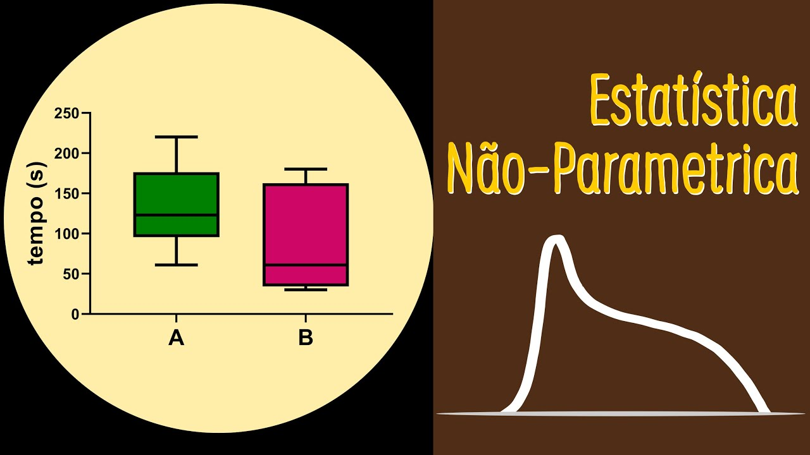

A **Estatística Não-Paramétrica** é uma abordagem de análise estatística que **não assume uma forma específica de distribuição** para os dados. Em contraste com a **Estatística Paramétrica**, que depende de **pressupostos rígidos**, como normalidade dos dados e homogeneidade de variâncias, os métodos não-paramétricos são mais **flexíveis e robustos**, sendo especialmente úteis quando os dados são **ordinais, categóricos ou provenientes de pequenas amostras**.

Enquanto a estatística paramétrica busca estimar parâmetros de distribuições conhecidas (como média e variância em uma distribuição normal), a não-paramétrica trabalha principalmente com **ordens, postos (rankings)** e **frequências**, evitando suposições rígidas e podendo ser aplicada em contextos mais amplos.

## Vantagens da Estatística Não-Paramétrica

-   Pode ser aplicada em situações com **dados não normais** ou quando não se conhece a distribuição populacional;
-   Apresenta **maior robustez a outliers**;
-   É apropriada para **pequenas amostras**, onde os testes paramétricos podem ter desempenho insatisfatório;
-   Funciona bem com **dados ordinais e categóricos**, que não satisfazem os requisitos para análise paramétrica.

## Desvantagens

-   Em geral, possuem **menor poder estatístico** quando os pressupostos dos testes paramétricos são atendidos;
-   **Não fornecem estimativas de parâmetros populacionais**, como média e desvio padrão, dificultando interpretações inferenciais mais precisas. 

## Quando Usar Métodos Paramétricos ou Não-Paramétricos

### Métodos Paramétricos

Utilize métodos paramétricos quando:

-   Os dados forem **quantitativos contínuos**;
-   Os pressupostos de alguma **distribuição conhecida** e **homogeneidade de variâncias** forem atendidos;
-   O objetivo for estimar parâmetros populacionais ou construir intervalos de confiança com maior precisão.

### Métodos Não-Paramétricos

Utilize métodos não-paramétricos quando:

-   Os dados forem **ordinais, categóricos** ou com **muitas assimetrias**;
-   Os pressupostos dos testes paramétricos **não forem atendidos**, especialmente em **amostras pequenas**;
-   Houver **outliers** que comprometam os resultados dos testes clássicos.

# Teste U de Mann–Whitney

O **Teste U de Mann–Whitney**, também conhecido como **teste de Wilcoxon para duas amostras independentes**, é uma alternativa **não paramétrica** ao teste t de Student. Ele permite verificar se duas amostras independentes provêm da mesma população quanto à **mediana**, **sem pressupor normalidade**.

Esse teste é particularmente útil quando:

-   Os dados não seguem distribuição normal;
-   As variâncias são diferentes;
-   As variáveis são ordinais ou contínuas e não podem ser modeladas de forma paramétrica.

## Hipóteses

Queremos testar se duas populações independentes têm **a mesma mediana**.

-   **Hipótese nula**($H_0$): as distribuições de $X$ e $Y$ são iguais, ou seja, 

$$md_X = md_Y;$$
-   **Hipótese alternativa**($H_1$): as distribuições são diferentes, ou seja, 
$$md_X \neq md_Y \ \text{(bilateral)} $$ 
ou 
$$md_X > md_Y  \ \text{ou} \ md_X < md_Y \text{(unilaterais)}. $$

## Metodologia

Queremos comparar dois amostras independentes ($X$ e $Y$) quanto à tendência central, **sem assumir normalidade**.

Por exemplo, 

-   Amostra $X$: 5, 7, 9\
-   Amostra $Y$: 1, 6, 8, 10

**Passo 1:** Combine as duas amostras em ordem crescente:

1, $\textcolor{blue}{5}$, 6, $\textcolor{blue}{7}$, 8, $\textcolor{blue}{9}$, 10

**Passo 2:** Atribua os postos para a sequência gerada no passo anterior. 

| Valor | Posto |
|-------|-------|
| 1     | 1     |
| $\textcolor{blue}{5}$     | 2     |
| 6     | 3     |
| $\textcolor{blue}{7}$    | 4     |
| 8     | 5     |
| $\textcolor{blue}{9}$    | 6     |
| 10    | 7     |

Identificando as amostras:

-   Amostra $X$: valores 5, 7, 9 → postos: 2, 4, 6\
-   Amostra $Y$: valores 1, 6, 8, 10 → postos: 1, 3, 5, 7

**Passo 3:** Calcule a soma dos postos para cada amostra. Denote por $R_X$ e $R_Y$ as somas dos postos atribuídos aos elementos das amostras $X$ e $Y$, respectivamente. 

-   Soma dos postos da amostra $X$:\
    $R_X = 2 + 4 + 6 = 12$.

-   Soma dos postos da amostra $Y$:\
    $R_Y = 1 + 3 + 5 + 7 = 16$.

> **Observação:** se as duas amostras possuem a mesma distribuições, esperamos que exista uma sobreposição considerável entre as duas amostras. O que implica que $R_X$ e $R_Y$ assumirão valores próximos.  

**Passo 4:** Calcule as estatísticas de Mann–Whitney. Sejam $n_X$ e $n_Y$ os tamanhos das amostras $X$ e $Y$, respectivamente. Defina  
$$U = \min(U_X, U_Y),$$
sendo $U_X = R_X - \dfrac{n_X(n_X + 1)}{2}$ e $U_Y = R_Y - \dfrac{n_Y(n_Y + 1)}{2}$.

> **Observação:** a estatísca $U$ mede a sobreposição das duas amostras levando em consideração o tamanho de cada amostra. Valores pequenos de $U$ indicam baixa sobreposição das amostra, corroborando com a hipótese alternativa. 

Para o exemplo, temos que 

- $n_X = 3$;
- $n_Y = 5$; 
- $U_X = 12 - \dfrac{3(3 + 1)}{2} = 12 - 6 = 6$;
- $U_Y = 16 - \dfrac{4(4 + 1)}{2} = 16 - 10 = 6$;
- $U = \min(6, 6) = 6$.

**Passo 5:** O **p-valor** pode ser calculado através do Python. E para um determinado nível de significância $\alpha$ tomar a decisão de rejeirar ou não a hipótese nula.

- Se p-valor $\leq$ $\alpha$, rejeitamos a hipótese nula ($H_0$). Ou seja, existe uma diferença significativa. 

- Caso contrário (p-valor $>$ $\alpha$), não rejeitamos $H_0$. Ou seja, não há evidência de diferença entre as duas amostra.   

## Exemplo:

Comparação entre marcas A e B de fertilizante no crescimento de plantas

Marca A ($n_1 = 6$): 78, 85, 83, 74, 88, 90\
Marca B ($n_2 = 7$): 82, 79, 76, 81, 77, 80, 78

**Objetivo**: Verificar se há diferença no efeito dos fertilizantes sobre o **crescimento das plantas**.

**Variável de estudo**: **crescimento das plantas** (em alguma unidade mensurável, como altura ou biomassa).

**Hipoteses:**

$H_0: md_X = md_Y \quad$
vs 
$\quad H_1: md_X \ne md_Y$

``` python
import numpy as np
from scipy.stats import mannwhitneyu

# Amostras
marca_A = np.array([78, 85, 83, 74, 88, 90]) 
marca_B = np.array([82, 79, 76, 81, 77, 80, 78])

# Aplicação do teste U de Mann-Whitney
stat, p_valor = mannwhitneyu(marca_A, marca_B, alternative='two-sided') 

# Interpretação do teste com nível de significância alpha = 5%
alpha = 0.05
if p_valor < alpha:
    print(f"Com p-valor = {p_valor:.4f} < {alpha}, rejeitamos H0.")
    print("Há evidência estatística de que existe diferença no efeito dos fertilizantes.")
else:
    print(f"Com p-valor = {p_valor:.4f} ≥ {alpha}, não rejeitamos H0.")
    print("Não há evidência estatística suficiente para afirmar de que existe diferença no efeito dos fertilizantes.")
```

# Teste de Wilcoxon (Postos com Sinais)

O **Teste de Wilcoxon para Postos com Sinais** é uma alternativa **não paramétrica** ao teste t pareado. Ele é utilizado para comparar **duas amostras relacionadas ou pareadas**, ou para testar se a **mediana de uma única amostra é igual a um valor específico**, sem assumir normalidade das diferenças.

Este teste é útil quando:

-   Os dados são pareados (e.g., antes e depois de um tratamento).
-   As diferenças entre os pares não seguem uma distribuição normal.
-   Queremos testar a mediana de uma amostra contra um valor hipotético ($m_0$).

## Hipóteses (Para uma amostra)

Queremos testar se a mediana populacional ($md$) é igual a um valor $m_0$.

-   **Hipótese nula**: $H_0: md = m_0$
-   **Hipótese alternativa**: $H_1: md \ne m_0$ \ ou \ $md > m_0$ \ ou \ $md < m_0$.

## Metodologia (Para uma amostra)

Amostra$ x = (12,\ 8,\ 11,\ 7,\ 10,\ 14,\ 9)$.

Hipóteses: $H_0:\ m_0 = 10$ \ vs \ $H_1:\ m_0\ne  10$.

**Passo 1:** Calcule as diferenças $d_i = x_i - m_0$.

| $x_i$ | $d_i = x_i - 10$ |
|-------|------------------|
| 12    | 2                |
| 8     | -2               |
| 11    | 1                |
| 7     | -3               |
| 10    | 0                |
| 14    | 4                |
| 9     | -1               |

**Passo 2:** Ignore as diferenças $d_i = 0$.

Removemos a observação $x = 10$ ($d = 0$).

Valores restantes:\
$d = (2,\ -2,\ 1,\ -3,\ 4,\ -1)$.

**Passo 3:** Calcule os valores absolutos das diferenças não nulas, $|d_i|$.

$|d| = (2,\ 2,\ 1,\ 3,\ 4,\ 1)$. 

**Passo 4:** Ordene os $|d_i|$ e atribua postos (com média em empates).

Valores ordenados: $(1,\ 1,\ 2,\ 2,\ 3,\ 4)$.

| $|d_i|$ | Posto |
|---------|-------|
| 1       | 1.5   |
| 1       | 1.5   |
| 2       | 3.5   |
| 2       | 3.5   |
| 3       | 5     |
| 4       | 6     |

**Passo 5:** Reatribua os sinais originais dos $d_i$ aos postos.

| $d_i$ | $|d_i|$ | Posto | Sinal aplicado |
|-------|---------|-------|----------------|
| 2     | 2       | +3.5  | \+             |
| -2    | 2       | -3.5  | \-             |
| 1     | 1       | +1.5  | \+             |
| -3    | 3       | -5    | \-             |
| 4     | 4       | +6    | \+             |
| -1    | 1       | -1.5  | \-             |

**Passo 6:** Calcule a soma dos postos positivos ($W^+$) e negativos ($W^-$). 

$W^+ = 3.5 + 1.5 + 6 = 11$

$W^- = 3.5 + 5 + 1.5 = 10$

**Passo 7:** A estatística do teste é $W = \min(W^+, W^-)$. 

$W = \min(11,\ 10) = 10$

> **Observação:** Se as duas amostras apresentam a mesma mediana é esperado que as somas dos posto positivos e negativos estejam próximos. Logo, $W$ muito pequeno indica que as duas amostra possuem medianas diferentes.   

**Passo 8:** Calcule o p-valor associado a $W$.

------------------------------------------------------------------------

## Exemplo (Para uma amostra)

**Teste da mediana de uma amostra:**

Amostra de tempos de reação (em segundos): 95, 92, 90, 96, 94, 91, 93. Queremos testar se a mediana do tempo de reação é igual a 70 segundos. 

Ou seja, queremos testar as hipóteses:

$$
H_0: md = 70 \quad \text{vs} \quad H_1: md \ne 70
$$

``` python
import numpy as np
from scipy.stats import wilcoxon

# Amostra observada (ex: tempos de reação em segundos)
x = np.array([95, 92, 90, 96, 94, 91, 93])

# Mediana sob a hipótese nula
m0 = 70

# O teste de Wilcoxon avalia se a mediana das diferenças (x - m0) é zero.
# Logo, usamos: diferencas = x - m0
diferencas = x - m0

# Aplicação do teste de Wilcoxon (teste bilateral por padrão)
# A função ignora automaticamente as diferenças iguais a zero
estatistica, p_valor = wilcoxon(diferencas)

# Resultado
print(f"Estatística W = {estatistica}, p-valor = {p_valor:.4f}")

# Interpretação do teste com nível de significância alpha = 5%
alpha = 0.05
if p_valor < alpha:
    print(f"Com p-valor = {p_valor:.4f} < {alpha}, rejeitamos H0.")
    print("Há evidência estatística de que a mediana da população é diferente de 70.")
else:
    print(f"Com p-valor = {p_valor:.4f} ≥ {alpha}, não rejeitamos H0.")
    print("Não há evidência estatística suficiente para afirmar que a mediana difere de 70.")
```

Com $W = 0$ e p-valor $= 0,0078$, temos:

-   Para p-valor $\leq \alpha$: **rejeitamos** $H_0$.

Há **forte evidência estatística** de que a mediana do tempo de reação é diferente de 70 segundos.\
Todos os valores da amostra estão bem acima de 70, o que levou a um p-valor pequeno no teste.

### Considerações Finais

-   O teste de Wilcoxon é mais poderoso que o teste do sinal quando as diferenças são aproximadamente simétricas.
-   Para amostras pareadas $(x_i, y_i)$, o teste é aplicado às diferenças $d_i = x_i - y_i$, testando $H_0: md_{diferença} = 0$.

# Teste de Kruskal-Wallis

O **Teste de Kruskal-Wallis** é uma extensão não paramétrica do teste U de Mann-Whitney e uma alternativa à Análise de Variância (ANOVA) de um fator. Ele é utilizado para comparar as **medianas de três ou mais grupos independentes**, verificando se pelo menos um dos grupos difere dos demais em termos de localização central, sem assumir a normalidade dos dados.

Este teste é apropriado quando:

-   Queremos comparar três ou mais grupos independentes.
-   Os dados não seguem uma distribuição normal dentro de cada grupo.
-   As variâncias entre os grupos não precisam ser homogêneas, mas é importante que as distribuições tenham formas semelhantes para que a diferença observada possa ser atribuída às medianas.
-   Os dados são pelo menos ordinais.

## Hipóteses

Queremos testar se as medianas de $k$ populações independentes são iguais.

-   **Hipótese nula**: $H_0$: As medianas de todas as $k$ populações são iguais, ou seja, 
$$
md_1 = md_2 = ... = md_k.
$$
-   **Hipótese alternativa**: $H_1$: Pelo menos uma mediana populacional é diferente das outras.

## Metodologia

**Passo 1:** Combine todas as observações dos $k$ grupos em um único conjunto de dados. Defina $N$ o número total de observações ($N = n_1 + n_2 + ... + n_k$), onde $n_i$ é o tamanho da amostra do grupo $i$.

**Passo 2:** Ordene todas as $N$ observações em ordem crescente e atribua postos (ranks) de 1 a $N$. Em caso de empates, atribua a média dos postos que seriam ocupados.

**Passo 3:** Calcule a soma dos postos para cada um dos $k$ grupos. Denote por $R_i$ a soma dos postos para o grupo $i$.

**Passo 4:** Calcule a estatística de teste $H$: 
$$
H = \frac{12}{N(N+1)} \sum_{i=1}^{k} \frac{R_i^2}{n_i} - 3(N+1).
$$ 
> **Se houver muitos empates, uma correção para** $H$ pode ser aplicada, mas geralmente tem pouco efeito a menos que a proporção de empates seja grande.

**Passo 5:** Calcule o p-valor associado a $H$.

**Passo 6:** Se o p-valor < $\alpha$, rejeite $H_0$. Isso sugere que há uma diferença estatisticamente significativa entre as medianas de pelo menos dois grupos.

------------------------------------------------------------------------

## Exemplo

**Comparação da eficácia de três métodos de ensino:**

Avaliamos as notas de alunos submetidos a três métodos de ensino diferentes (A, B, C).

-   Método A ($n_1 = 4$): 75, 80, 82, 78
-   Método B ($n_2 = 4$): 85, 88, 90, 81
-   Método C ($n_3 = 4$): 70, 72, 76, 68

Queremos testar as hipóteses:

$H_0: md_A = md_B = md_C \quad \text{vs} \quad H_1: \text{Pelo menos uma mediana é diferente}$

```{python}
import numpy as np
from scipy.stats import kruskal

# Dados
metodo_A = np.array([75, 80, 82, 78])
metodo_B = np.array([85, 88, 90, 81])
metodo_C = np.array([70, 72, 76, 68])

# Teste de Kruskal-Wallis
stat, p_valor = kruskal(metodo_A, metodo_B, metodo_C)
print(f"Estatística H = {stat:.4f}, Valor-p = {p_valor:.4f}")

# Interpretação
alpha = 0.05
if p_valor < alpha:
    print(f"Com valor-p = {p_valor:.4f} < {alpha}, rejeitamos H0.")
    print("Há evidência estatística para sugerir que pelo menos um método de ensino difere dos outros em termos de notas medianas.")
else:
    print(f"Com valor-p = {p_valor:.4f} >= {alpha}, não rejeitamos H0.")
    print("Não há evidência estatística suficiente para sugerir uma diferença entre as notas medianas dos métodos de ensino.")
```

### Considerações Finais

-   O teste de Kruskal-Wallis é uma ferramenta robusta para comparar múltiplos grupos quando as premissas da ANOVA não são atendidas.
-   Se a hipótese nula for rejeitada, são necessários testes post hoc, que são comparações adicionais entre pares de grupos, para identificar especificamente quais grupos diferem entre si de forma significativa.

# Teste de Friedman

O **Teste de Friedman** é uma alternativa não paramétrica à Análise de Variância (ANOVA) para medidas repetidas ou blocos aleatorizados. Ele é utilizado para comparar as **distribuições de três ou mais grupos relacionados (dependentes)**, verificando se há diferenças significativas entre as condições ou tratamentos aplicados aos mesmos sujeitos ou blocos.

Este teste é uma extensão do teste de Wilcoxon para postos com sinais para mais de duas amostras pareadas e é particularmente útil quando:

-   Queremos comparar três ou mais condições/tratamentos aplicados aos mesmos sujeitos (medidas repetidas).
-   Os dados são organizados em blocos, onde cada bloco contém um conjunto de observações relacionadas (e.g., diferentes fertilizantes aplicados em diferentes blocos de terra com características semelhantes).
-   As suposições da ANOVA para medidas repetidas (como normalidade das diferenças e esfericidade) não são atendidas.
-   Recomendado que os dados sejam ordinais.

## Hipóteses

Queremos testar se as distribuições de $k$ tratamentos (ou condições) aplicados a $n$ blocos (ou sujeitos) são iguais.

-   **Hipótese nula**: $H_0$: As distribuições dos $k$ tratamentos são idênticas (i.e., não há efeito do tratamento).
-   **Hipótese alternativa**: $H_1$: Pelo menos uma distribuição de tratamento difere das outras (i.e., há um efeito do tratamento).

## Metodologia

**Passo 1:** Organize os dados em uma matriz onde as linhas representam os blocos (ou sujeitos) e as colunas representam os tratamentos (ou condições).

**Passo 2:** Dentro de cada bloco (linha), ordene as observações dos $k$ tratamentos em ordem crescente e atribua postos (ranks) de 1 a $k$. Em caso de empates dentro de um bloco, atribua a média dos postos.

**Passo 3:** Calcule a soma dos postos para cada tratamento (coluna). denote por $R_j$ a soma dos postos para o tratamento $j$.

**Passo 4:** Calcule a estatística de teste $Q$ (também referida como $\chi^2_r$ ou $F_r$): 
$$
Q = \frac{12}{nk(k+1)} \sum_{j=1}^{k} R_j^2 - 3n(k+1).
$$ 
Onde $n$ é o número de blocos (sujeitos) e $k$ é o número de tratamentos (condições). 

> **Observação:** Existem correções para empates, mas a fórmula acima é a mais comum.

**Passo 5:** Calcule o valor-$p$ associado a $Q$.

**Passo 6:** Se $Q$ for maior que o valor crítico (ou se o valor-$p < \alpha$), rejeite $H_0$. Isso sugere que há uma diferença estatisticamente significativa entre pelo menos dois tratamentos/condições.

------------------------------------------------------------------------

## Exemplo

**Comparação da eficácia de três analgésicos:**

Doze pacientes ($n=12$) receberam três analgésicos diferentes (A, B, C) em momentos distintos, e a eficácia foi medida em uma escala ordinal de alívio da dor (maior valor = maior alívio). Queremos verificar se há diferença na eficácia percebida entre os analgésicos.

(Dados hipotéticos para ilustração - precisaria de uma matriz 12x3)

``` python
from scipy.stats import friedmanchisquare

# Dados hipotéticos
# Cada linha é um paciente, cada coluna é um analgésico (A, B, C)
# Exemplo com 4 pacientes para simplificar
paciente1 = [6, 8, 7]
paciente2 = [5, 5, 6]
paciente3 = [7, 9, 8]
paciente4 = [8, 9, 9]

# A função friedmanchisquare recebe os dados por tratamento (colunas)
analgesico_A = np.array([p[0] for p in [paciente1, paciente2, paciente3, paciente4]])
analgesico_B = np.array([p[1] for p in [paciente1, paciente2, paciente3, paciente4]])
analgesico_C = np.array([p[2] for p in [paciente1, paciente2, paciente3, paciente4]])

# Executando o teste
stat, p_valor = friedmanchisquare(analgesico_A, analgesico_B, analgesico_C)
print(f"Estatística Q = {stat:.4f}, Valor-p = {p_valor:.4f}")

# Interpretação:
alpha = 0.05
if p_valor < alpha:
    print(f"Com valor-p = {p_valor:.4f} < {alpha}, rejeitamos H0.")
    print("Há evidência estatística para sugerir que pelo menos um analgésico difere dos outros em termos de eficácia percebida.")
    # Nota: Testes post-hoc (como Nemenyi ou comparações par a par com Wilcoxon e correção) 
    # podem ser usados para identificar quais pares de analgésicos diferem.
else:
    print(f"Com valor-p = {p_valor:.4f} >= {alpha}, não rejeitamos H0.")
    print("Não há evidência estatística suficiente para sugerir uma diferença na eficácia percebida entre os analgésicos.")
```

### Considerações Finais

-   O teste de Friedman é adequado para desenhos experimentais com blocos ou medidas repetidas quando a ANOVA paramétrica não é aplicável.
-   Assim como no Kruskal-Wallis, a rejeição de $H_0$ indica que *existe* uma diferença, mas não *onde*. Testes *post-hoc* são necessários para comparações específicas entre pares de tratamentos.

# Correlação de Spearman ($\rho$)

O Coeficiente de Correlação de Postos de Spearman, denotado por $\rho$ (rho), é uma medida não paramétrica da força e direção da associação monotônica entre duas variáveis ordinais ou contínuas. Ele avalia o quão bem a relação entre duas variáveis pode ser descrita usando uma função monotônica (uma função que é inteiramente não crescente ou inteiramente não decrescente).

Ao contrário do coeficiente de correlação de Pearson, que mede a associação linear, Spearman não assume linearidade nem normalidade dos dados. Ele opera sobre os **postos** (ranks) dos dados.

Este coeficiente é útil quando:

-   As variáveis são ordinais.
-   As variáveis são contínuas, mas a relação não é linear ou os dados não seguem distribuição normal bivariada.
-   Queremos medir a força de uma relação monotônica, não necessariamente linear.
-   Há presença de outliers que poderiam distorcer a correlação de Pearson.

## Hipóteses

Queremos testar se existe uma correlação monotônica significativa entre duas variáveis $X$ e $Y$ na população.

-   **Hipótese nula**: $H_0$: Não há correlação monotônica entre $X$ e $Y$ na população ($\rho = 0$).
-   **Hipótese alternativa**: $H_1$: Existe correlação monotônica entre $X$ e $Y$ na população ($\rho \neq 0$). Pode ser unilateral ($H_1: \rho > 0$ ou $H_1: \rho < 0$) se houver uma direção esperada para a correlação.

## Metodologia

**Passo 1:** Obtenha os pares de observações $(x_i, y_i)$ para as duas variáveis, com $n$ pares no total.

**Passo 2:** Ordene os valores de $X$ e atribua postos $R(x_i)$ de 1 a $n$. Faça o mesmo para os valores de $Y$, atribuindo postos $R(y_i)$. Em caso de empates, atribua a média dos postos.

**Passo 3:** Calcule as diferenças entre os postos para cada par: $d_i = R(x_i) - R(y_i)$.

**Passo 4:** Calcule o coeficiente de correlação de Spearman $\rho$:

-   Se não houver empates nos postos: $$
    \rho = 1 - \frac{6 \sum_{i=1}^{n} d_i^2}{n(n^2 - 1)}
    $$
-   Se houver empates (ou de forma geral, pois funciona em ambos os casos), calcule a correlação de Pearson sobre os postos $R(x_i)$ e $R(y_i)$.

**Passo 5:** O valor de $\rho$ varia entre -1 e +1. 
-   $\rho = +1$ indica uma relação monotônica positiva perfeita. 
-   $\rho = -1$ indica uma relação monotônica negativa perfeita. 
-   $\rho = 0$ indica ausência de relação monotônica.

**Passo 6:** Calcule o p-valor associado. 
------------------------------------------------------------------------

## Exemplo

**Correlação entre horas de estudo e nota em um exame:**

Queremos verificar se há uma associação monotônica entre o número de horas que 10 alunos estudaram ($X$) e suas notas em um exame ($Y$).

-   Horas ($X$): (5, 8, 12, 4, 10, 6, 15, 7, 9, 11)
-   Notas ($Y$): (65, 75, 85, 60, 80, 70, 95, 72, 78, 88)

Queremos testar as hipóteses:

$H_0: \rho = 0 \quad \text{vs} \quad H_1: \rho \neq 0$.

``` python
# Caso o pacote scipy não esteja instalado, você pode descomentar a linha abaixo para instalá-lo.
# !pip install scipy

# Importando a função necessária
from scipy.stats import spearmanr
import numpy as np

# Dados
horas_estudo = np.array([5, 8, 12, 4, 10, 6, 15, 7, 9, 11])
notas_exame = np.array([65, 75, 85, 60, 80, 70, 95, 72, 78, 88])

# Calculando a correlação de Spearman e o p-valor
# A função retorna (coeficiente, valor-p)
coeficiente, p_valor = spearmanr(horas_estudo, notas_exame)

print(f"Coeficiente de Correlação de Spearman (rho) = {coeficiente:.4f}")
print(f"Valor-p = {p_valor:.4f}")

# Interpretação:
alpha = 0.05
if p_valor < alpha:
    print(f"Com valor-p = {p_valor:.4f} < {alpha}, rejeitamos H0.")
    if coeficiente > 0:
        print("Há evidência estatística de uma correlação monotônica positiva significativa entre horas de estudo e notas.")
    elif coeficiente < 0:
        print("Há evidência estatística de uma correlação monotônica negativa significativa entre horas de estudo e notas.")
    else:
        # Caso raro onde p < alpha mas coeficiente é 0 (pode ocorrer com poucos dados e empates)
        print("Há evidência estatística de uma correlação monotônica significativa, mas o coeficiente é zero.")
else:
    print(f"Com valor-p = {p_valor:.4f} >= {alpha}, não rejeitamos H0.")
    print("Não há evidência estatística suficiente para sugerir uma correlação monotônica significativa entre horas de estudo e notas.")
```

### Considerações Finais

-   Spearman é robusto a outliers e não exige linearidade, sendo uma ótima alternativa a Pearson quando suas premissas não são válidas.
-   Interpreta a força da correlação de forma similar a Pearson: valores mais próximos de \|1\| indicam associação mais forte.
-   É importante lembrar que correlação não implica causalidade.

# Referências

GIBBONS, J. D.; CHAKRABORTI, S. **Nonparametric Statistical Inference**. 5th ed. Chapman & Hall/CRC, 2010.

WASSERMAN, L. **All of Nonparametric Statistics**. Springer, 2006.

CORDER, G. W.; FOREMAN, D. I. **Nonparametric Statistics for Non-Statisticians: A Step-by-Step Approach**. 2nd ed. Wiley, 2014.
