# Porque o python?

Python é uma linguagem de programação rápida de se programar dado a sua simplicidade e versatilidade. Abstrações de detalhes técnicos do computador são usadas na linguagem para auxiliar o programador no desenvolvimento de programas, extraindo recursos presentes em outras linguagens a fim de manter apenas o essencial ao programador.

Em outras linguagens o programador está sempre preocupado se está usando a tipagem correta, se está compilando os programas com as referências externas corretas, se os buffers de input estão limpos, se a memória alocada é suficiente, tudo isso para receber uma falha de segmentação depois de esquecer um ; em algum lugar.

Mas o que é tudo isso? Muitos nomes difíceis de conceitos que parecem ainda mais difíceis. No Python nada disso é necessário. Python simplifica o processo de programar. Não que esses processos difíceis deixem de existir, mas eles são feitos de maneira automática pelo próprio Python. Contudo, isso tem um custo, Python é conhecido por ser uma linguagem de processamento lento e para certas aplicações que exigem boa performance, como um videogame, existem alternativas melhores. Essa simplicidade do Python faz com que os códigos possam ser desenvolvidos mais rapidamente. Aplicações que são focadas para resolver um problema específico, como a ciência de dados, usam a programação como o meio de resolver e não com o objetivo de executar o programa da maneira mais rápido possível, portanto aproveitam esse aspecto da linguagem. O programador pode focar no que importa de verdade que é a entrega final.

Outro ponto que explica o sucesso do Python é a sua comunidade. Milhares de programadores contribuem para o ecossistema de desenvolvimento com soluções que antes não eram contempladas originalmente. Desde ferramentas de criação de sites até inteligência artificial, o leque de opções do Python é vasto. Para ciência de dados as ferramentas pandas e numpy, desenvolvidas pela comunidade, são imprescindíveis.

Por essas e outras razões, Python é uma das principais linguagens de programação da atualidade.

# Instalação (Windows)

Para instalar o Python acesse o link <https://www.Python.org/downloads/> e faça o download da versão mais recente. Quando o download for concluído, execute o instalador baixado, marque a opção **Add Python.exe to PATH** e clique no **Install Now**, seguindo as opções padrões do Python.

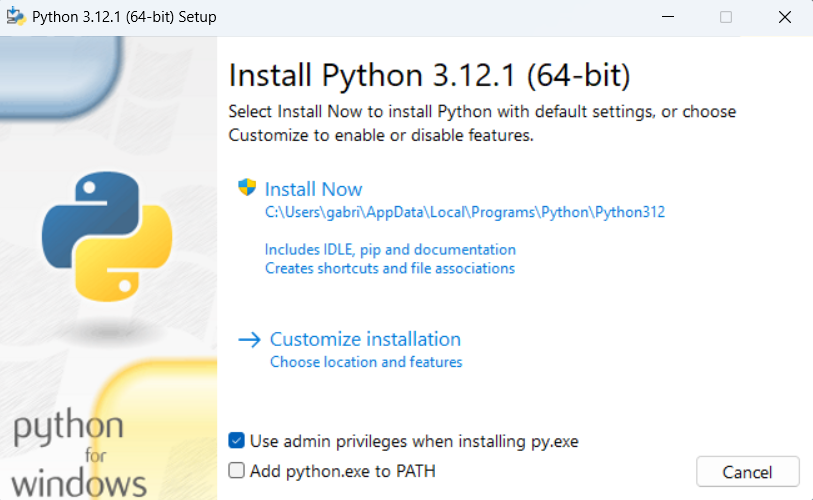


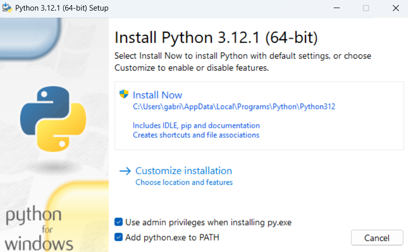

Nesta etapa instalamos o interpretador do Python, que é responsável por dar ao computador a capacidade de executar códigos em Python. 

TIRAR ESTE TRECHO **Todos os programas em Python são executados com o interpretador, o computador entende naturalmente apenas códigos binários, o interpretador é como se fosse um tradutor para o computador.**

## Primeiros Passos 

Tradicionalmente na programação o primeiro código executado quando se instala uma linguagem nova é o *Hello World*. Um programa simples que diz apenas *Hello World* quando executado. O código em Python é dado por 

``` python
print("Hello World")
```

Porém como diremos para o Python executar o código? E aonde que ele dirá esse *Hello World*? 

TIRAR ESTE TRECHO **Ele não tem uma interface visual que nem o Excel que você coloca numa célula uma fórmula que o excel executa.**

Existem duas maneiras de executar um programa no Python: diretamente pelo interpretador e através de um arquivo.

Para executar diretamente pelo interpretador, pesquise no menu **Iniciar** por Python e abra o aplicativo do Python. Digite o código em Python que quiser depois do \>\>\> e aperte enter.

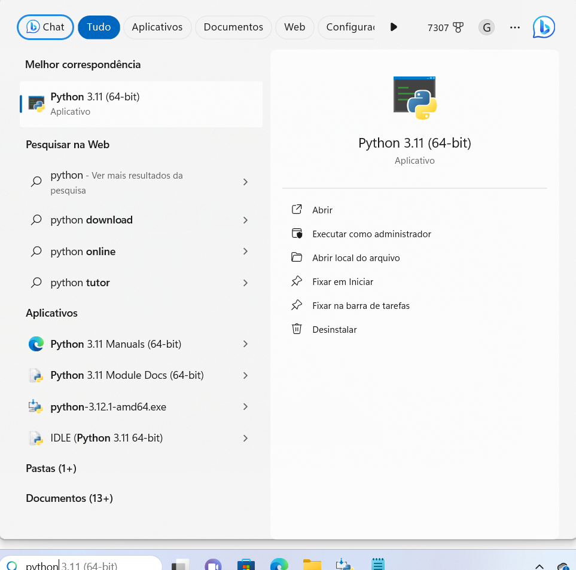

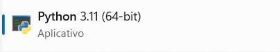

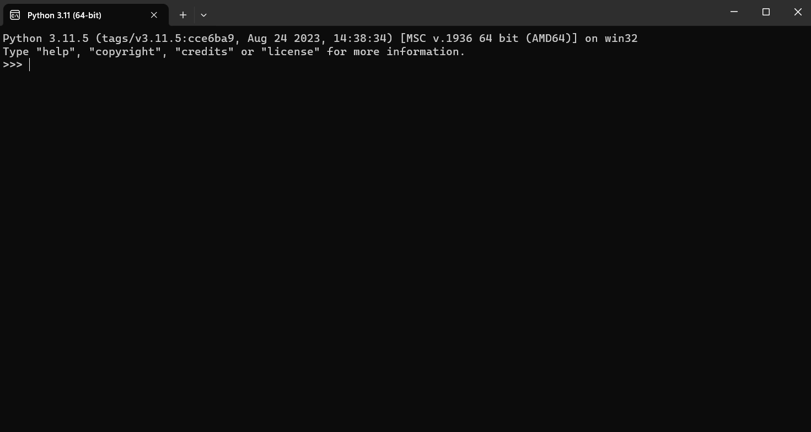

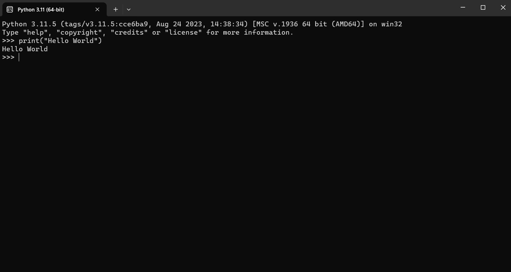

A execução pelo interpretador, em geral, não é muito útil porque não podemos reproduzir o que fizemos de maneira automática. Precisamos reescrever cada linha de código que escrevemos anteriormente. 

A outra alternativa de execução de um código em Python é via um arquivo, onde escrevemos os códigos sequencialmente e eles serão todos executados pelo interpretador em ordem, assim mantemos o registro do que foi executado no arquivo, facilitando sua edição.

Para executar um código em Python presente em um arquivo precisamos cria-lo com extensão **.py** e chamar o interpretador para ler o arquivo. Isto pode ser feito através do terminal de comando do sistema operacional. Para iniciantes na programação, esse método cria uma dificuldade que pode atrapalhar no processo de aprendizagem.

## IDEs (*Integrated Development Environment*)

Existem ferramentas desenvolvidas com a finalidade de simplificar o processo de se programar em Python. O nome desse tipo de ferramenta é IDE (*Integrated Development Environment*) ambiente de desenvolvimento integrado. As funcionalidades mais comuns de uma IDE é a marcação de texto, que ajuda a legibilidade do código destacando palavras chaves da linguagem, explorador de arquivos, que auxilia na criação, remoção e alteração de arquivos, e terminal de comando integrado, um espaço para executar os programas com apenas um botão. Para a ciência de dados a mais utilizada por desenvolvedores em Python é o Jupyter.

## Instalação e Execução do Jupyter

Para instalar o Jupyter precisaremos usar o `pip`, uma ferramenta do Python que permite a instalação de complementos a linguagem, mais a frente exploraremos esse assunto melhor. No espaço **pesquisar** do windows digite **cmd** e aperte enter. O **cmd** é o terminal de comandos do windows, a interface (ou a falta dela) pode assustar um pouco, para o que queremos é só digitar **pip install Jupyter** e apertar enter, após o comando ser inserido, o terminal irá instalar a extensão do Jupyter ao Python. Uma vez instalado o Jupyter não precisa reinstalar novamente quando for usar.


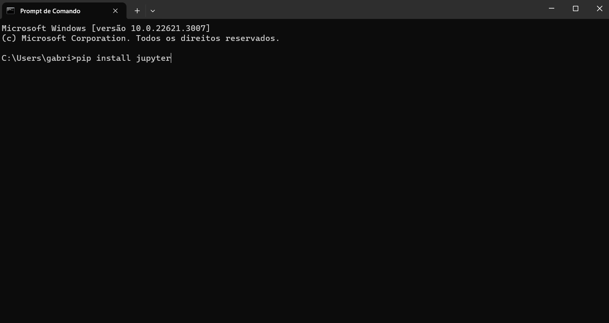

Para abrir o Jupyter precisamos abrir o terminal de comando, e digitar **jupyter notebook** e apertar enter. Ao fazer isso, o navegador padrão irá abrir uma aba do Jupyter.

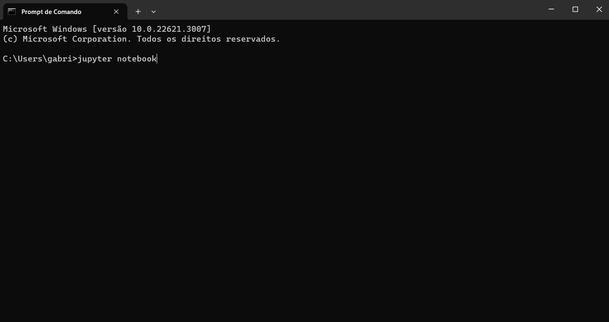

Importante não fechar o prompt de comando que executou o Jupyter, se não o Jupyter para de funcionar.

## Hello World no Jupyter

A primeira tela do Jupyter é o explorador de arquivos do seu sistema operacional (no caso Windows 11). Aqui você deve selecionar a qual pasta o projeto criado será salvo. Criei a pasta **Aprendendo Python**. O local ou o nome da pasta que salvará o projeto não é importante, pode ser salva inclusive no diretório inicial que aparece no Jupyter (embora seja recomendado criar uma pasta nova para cada projeto para uma melhor organização).

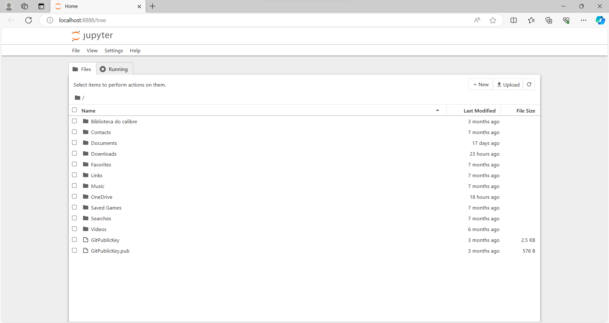

Para criar uma pasta ou um arquivo novo no Jupyter basta selecionar o local desejado no explorador de arquivos clicando duas vezes nos caminhos possíveis e depois apertando o botão New e a opção New Folder. Suponha que queremos criar a pasta do projeto dentro do OneDrive então clique duas vezes na pasta OneDrive depois aperte o botão **New** e selecione a opção **New Folder**. Para renomear, deletar, copiar e outras funcionalidades padrões é só apertar com o botão direito em cima da pasta. Clique duas vezes na pasta Aprendendo Python que acabamos de criar e usando uma outra opção do botão **New** chamada **Notebook** crie o arquivo onde vamos escrever os programas em Python a partir de agora.

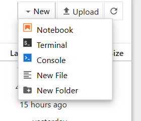

Automaticamente o Jupyter abrirá uma janela no navegador **Select Kernel**, selecione a opção **"Always start with the preferred kernel"** e aperte a opção **Select** (o Jupyter está perguntando qual versão do Python usar, alguns programadores podem ter mais de uma versão do Python no computador).

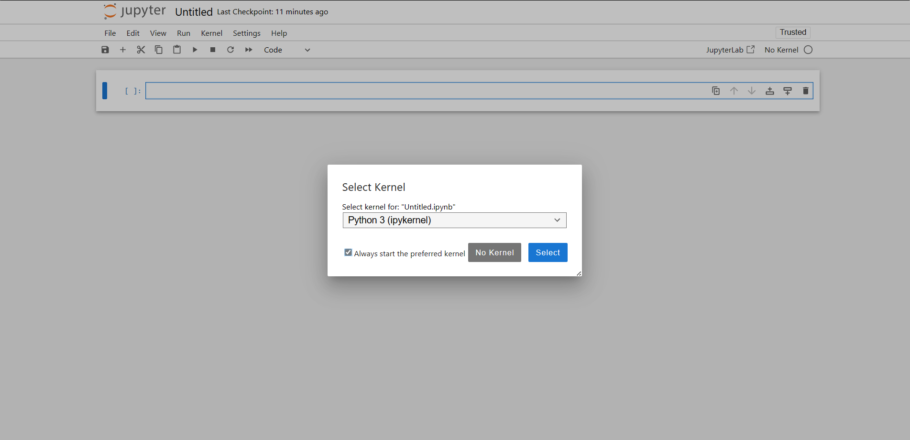

Agora estamos finalmente no arquivo que executará programas em Python. Escrevendo `print("Hello World")` no arquivo e apertando o botão de **run** ou **start** (▶), o código será executado.


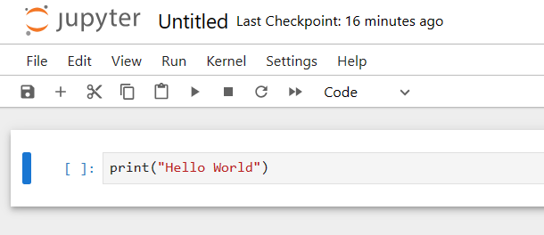

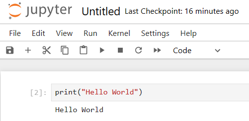

Podemos ainda executar vários comandos de uma vez só. Veja esse exemplo:

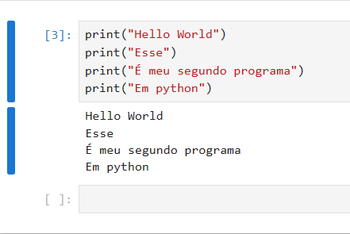

# Função `print`

O `print` é uma das funções mais importantes do Python por ser a principal ferramenta de comunicação entre o programa, o programador e o usuário.

**TIRAR??? Linguagens de programação quase sempre tem os comandos no imperativo da língua inglesa, já que os ingleses e posteriormente os americanos foram pioneiros no desenvolvimento da ciência da computação. `print` significa literalmente "imprimir".**

O `print` imprime na tela o conteúdo entre parênteses. Se o conteúdo for textual precisa estar entre aspas. Números podem ser inseridos diretamente sem o uso de aspas. 
O `print` por configuração padrão imprime as mensagens pulando uma linha depois. Para mudar essa configuração em um print específico, no final do comando, antes de fechar os parênteses, coloque `, end=" "`. Agora para esse `print` específico a linha não será pulada no final da execução:

``` {python}
print("Hello World")
print("Esse", end=" ")
print("é meu terceiro programa", end=" ")
print("em Python")
```

# Variáveis

Na escola quebramos a cabeça em matemática para resolver uma equação. A professora Márcia que todos tivemos passa uma expressão: 4 + x = 7. Mesmo como crianças sabíamos que para o 4 virar 7 o x precisaria ser um 3, o x armazena o valor 3. Na programação existem inúmeras vantagens de se usar variáveis.

Voltando para o exemplo do print, digamos que queremos imprimir uma mesma mensagem inúmeras vezes:

``` {python}
print("Ciência de dados!")
print("Ciência de dados!")
print("Ciência de dados!")
print("Ciência de dados!")
```

Agora quero invés de imprimir "Ciência de dados!" quero imprimir "O meu filme favorito é troll 2!". Para fazer isso teríamos que trocar cada uma das vezes o texto dentro do print pelo texto desejado. Existe alguma forma mais rápida de fazer isso: usando variáveis. Podemos criar uma variável x, que nem das aulas de matemática da professora Márcia que armazena o texto a ser impresso.

``` {python}
x = "Ciência de dados!"
print(x)
print(x)
print(x)
print(x)
```

Reparem que ambos os programas realizam a mesma tarefa, de maneiras diferentes. A vantagem do segundo programa é que para mudar o texto impresso para "O meu filme favorito é troll 2!" basta trocar o valor de x:

``` {python}
x = "O meu filme favorito é troll 2!"
print(x)
print(x)
print(x)
print(x)
```

A escolha do uso da nomenclatura `x` para realizar a tarefa é apenas para seguir a didática da professora Márcia. Porém, idealmente a nomeação de variáveis se faz baseado no uso dela, isto é, idealmente criamos variáveis com nomes elusivos. Nesse caso, ao invés de `x` usar `texto`. Isso facilita em projetos maiores quando várias pessoas trabalham juntas ou quando você precisa rever um código antigo.

Para criar uma variável basta colocar o nome que gostaria no início, seguido de `=` e depois o valor que gostaria de armazenar. 

```{python}
texto = "O meu filme favorito é troll 2!"
```

O computador então passa a entender que sempre que escreve texto no código é para substituir pelo valor "O meu filme favorito é troll 2!".

O python possui algumas regras para nomeação de variáveis. Assim como todas as linguagens de programação, existem alguns comandos que fazem uma tarefa, como o print. Esses comandos ou como chamamos na programação, funções, possuem o status de palavra reservada, que não podem ser usadas para outras coisas, entre outras palavras. Outras regras de nomeação de variáveis no python é que as variáveis não podem começar com números (podem ter números, só não como primeiro caracter), não podem ter `.` e nem espaços.

# Tipos de Variáveis 

No exemplo anterior, `x` é uma variável não numérica, para definirmos 

``` python
x = 4
```

Note que para colocar um número não precisa colocar entre aspas. Essa diferença se dá no tipo do dado atribuído, um conceito importantíssimo em linguagens de programação. Enquanto "O meu filme favorito é troll 2!" é um texto, 4 é um número.

Mas poderíamos também ter feito x = "4"? Então o que seria? Nesse caso seria um texto.

O que define se um dado é do tipo texto é se ele está entre `" "` e um dado do tipo numérico é um número que não está entre aspas. Mas então qual a diferença?

``` python
x = 4
y = "4"
print(x)
print(y)
```

::: callout
```         
4
4
```
:::

Pelo print parece a mesma coisa. A diferença seria no comportamento que essas variáveis vão ter no programa. Digamos que eu queira somar duas variáveis. Para isso utilizamos operadores matemáticos. O que se espera que será o resultado de x + x? 8, certo? E de y + y? Não será 8.

``` python
x = 4
y = "4"
print(x + x)
print(y + y)
```

::: callout
```         
8
44
```
:::

Textos, ao invés de somarem, concatenam quando usamos o operador `+`. Falaremos mais de operadores em breve.

Quando criamos uma variável nova, estamos criando uma instância de um tipo, ou instanciando um tipo.

Cada tipo possui características próprias, que vão além de apenas o comportamento frente a operadores. Forma de instanciar, memória do computador usada, uso em funções, cada uma dessas características definem um `tipo`.

## Função type()

Antes de entrar mais especificamente em cada tipo, precisamos falar de uma ferramenta importante. Existe uma função no python que retorna o tipo de uma variável, o `type()`, que quando usado com o print imprime o tipo na tela. Veja um exemplo:

``` python
x = 4
print(type(x))
```

::: callout
```         
class 'int'
```
:::

Repare que uma função pode ser usada dentro de outra. Falaremos mais de funções em breve.

Sabemos que se trata de um int, afinal, nós criamos essa variável. Porém, como muitas coisas na programação, quando se aumenta a escala saber o tipo específico de uma variável em um programa maior ou de outra pessoa pode ser um pouco mais difícil.

Dito isso, podemos agora falar dos principais tipos.

## Principais tipos de variáveis

### int

Abreviação para `integer`, que traduzido do inglês significa inteiro. São equivalentes a números inteiros da matemática, podendo ser positivos ou negativos e se comportam igual na matemática.

**Instanciação**

Sempre que colocamos números sem estar entre aspas estamos instanciando um int:

``` python
x = 4
print(x)
print(type(x))
```

::: callout
```         
4
class 'int'
```
:::

### str

Abreviação de `string`, que traduzido do inglês significa fio, corda ou barbante, mas quando usado na programação significa cadeia, uma cadeia de caracteres. Linguagens de programação tradicionalmente possuem o tipo char, que é uma abreviação de characters que traduzido do inglês é caracteres. Esse tipo armazena apenas um caractere textual, o conjunto desses caracteres que é chamado de string. No python, para simplificar, todo dado textual é `str`.

**Instanciação**

Sempre que colocamos caracteres entre aspas simples ('') ou duplas(""). Podemos também usar """ """. Esse último é usado para quando queremos escrever um texto em mais de uma linha de código no python. Segue abaixo exemplos de instanciação:

``` python
texto1 = "Ciência de dados!"
texto2 = 'O meu filme favorito é "troll 2"!'
texto3 = """Minha terra tem palmeiras
Onde canta o Sabiá,
As aves, que aqui gorjeiam,
Não gorjeiam como lá."""

print(texto1)
print(type(texto1))
print(texto2)
print(type(texto2))
print(texto3)
print(type(texto3))
```

::: callout
```         
Ciência de dados!
class 'str'
O meu filme favorito é "troll 2"!
class 'str'
Minha terra tem palmeiras
Onde canta o Sabiá,
As aves, que aqui gorjeiam,
Não gorjeiam como lá.
class 'str'
```
:::

Note que para usar aspas duplas dentro de uma string (str) precisamos escrever a string entre aspas simples para não terminar precocemente a string, o que resultaria em um erro. O contrário também serve para aspas simples como no apóstrofe da frase em inglês: `"That's life."`.

### float

É o equivalente aos números racionais da matemática.

O nome `float` vem do padrão de `ponto flutuante`, uma técnica da computação para representar números com casas decimais no sistema binário. Enquanto os números inteiros têm uma tradução mais simples para o binário, as frações decimais muitas vezes resultam em sequências binárias infinitas, similar à dízima periódica. O padrão float é uma forma eficiente, mas aproximada, de lidar com isso.

**Instanciação**

Sempre que colocamos números com a parte decimal explicita, o python reconhece como um `float`. Lembramos que a linguagem usa o sistema americano, que utiliza o ponto como separador decimal.

``` python
numeroRacional1 = 1.0
numeroRacional2 = 56.133000
print(numeroRacional1)
print(type(numeroRacional1))
print(numeroRacional2)
print(type(numeroRacional2))
```

::: callout
```         
1.0
class 'float'
56.133
class 'float'
```
:::

Note que o python por padrão corta os zeros à direita por padrão, ele só mantém o primeiro decimal obrigatóriamente para mostrar que se trata de um float.

### bool

A classe `bool` (booleanos) representa valores lógicos binários: *True* (Verdadeiro) ou *False* (Falso). Esses valores são o resultado de operações de comparação (ex.: ==, \>) e lógicas (ex.: and, or), e são essenciais para estruturas condicionais que dirigem a lógica de um programa.

**Instanciação**

Para instanciar, podemos escrever simplesmente True ou False, sem aspas. Outra opção é fazer um teste com operadores lógicos.

``` python
chovendo = True
calor = False
Teste = 4 > 7
print(chovendo)
print(type(chovendo))
print(calor)
print(type(calor))
print(Teste)
print(type(Teste))
```

::: callout
```         
True
type 'bool'
False
type 'bool'
False
type 'bool'
```
:::

Existem diversos operadores lógicos que analisam sentenças lógicas e retornam um booleano. Falaremos deles assim que terminarmos os principais tipos de dados.

### list

Antes de aprender sobre listas (`list`) em Python, é útil entender o conceito de vetor na computação. Um vetor é uma estrutura de dados que armazena uma coleção ordenada de itens do mesmo tipo, de forma eficiente. Em Python, a estrutura nativa mais similar a um vetor é o `array` (do módulo array).

As listas são muito mais flexíveis: elas podem armazenar itens de tipos diferentes e são a estrutura mais comum e versátil para guardar sequências de elementos.

**Instanciação**

Para instanciar uma lista no python usamos colchetes, e separamos diferentes elementos com uso de vírgulas:

``` python
Numeros = [1, 2, 3, 4]
print(Numeros)
print(type(Numeros))

Frutas = ["Morango", "Pera", "Banana"]
print(Frutas)
print(type(Frutas))

Mix = [1, "Morango", 2, "Pera" ]
print(Mix)
print(type(Mix))
```

::: callout
```         
[1, 2, 3, 4]
<class 'list'>
['Morango', 'Pera', 'Banana']
<class 'list'>
[1, 'Morango', 2, 'Pera']
<class 'list'>
```
:::

Existem outros tipos de vetores além das listas no próprio python: `tuple`, `set`, `dict`. Eles são usados em certas situações mais específicas. Para se aprofundar no python são indispensáveis. Quando chegarmos no uso de ferramentas mais diretas para ciência de dados falaremos um pouco mais sobre isso.

**Uso**

Cada elemento de uma lista é acessível usando o nome da lista e colchetes com o índice do elemento na lista começando por 0 (índice zero aponta para o primeiro elemento da lista, uma herança do sistema binário dos computadores no python).

``` python
Frutas = ["Morango", "Pera", "Banana"]
print(Frutas[0])
print(Frutas[1])
print(Frutas[2])
```

::: callout
```         
Morango
Pera
Banana
```
:::

Se tentarmos acessar um índice que não existe na lista, digamos, queremos acessar o quarto elemento da lista Frutas acarretará em um erro:

``` python
Frutas = ["Morango", "Pera", "Banana"]
print(Frutas[3])
```

::: callout
```         
Traceback (most recent call last):
File "stdin", line 1, in module
IndexError: list index out of range
```
:::

Esse erro é bem frequente quando trabalhamos com listas.


**Matrizes**

Existem ainda listas de lista, as chamadas matrizes. Matrizes na álgebra podem ser entendidas como conjunto de vetores, na computação é o mesmo entendimento. Elas são particularmente interessantes quando estamos usando um conjunto grande de dados. Imagina que além da matrícula e do nome temos a idade, o curso, o período que entrou na faculdade etc. Podemos ter apenas uma lista que possui todas essas listas.

``` python
cabecalhoInformacoesAlunos = ["matricula", "nome", "idade", "curso", "semestreIngresso"]
matrizInformacoesAlunos = [[123, 456, 789], ["Anderson", "Antonio", "Alexandre"], [20, 18, 33], ["estatística", "direito", "medicina"], ["2023.1", "2019.1", "2020.2"]]
print(matrizInformacoesAluno)
```

::: callout
```         
[[123, 456, 789], ["Anderson", "Antonio", "Alexandre"], [20, 18, 33], ["estatística", "direito", "medicina"], ["2023.1", "2019.1", "2020.2"]]
```
:::

É importante lembrarmos a qual se refere cada lista da matriz, por isso a variável cabecalhoInformacoesAlunos. Em ferramentas específicas para ciência de dados no python isso é feito diretamente, mas no fundo é uma abstração do código a cima. Não preciso nem dizer que isso faz sentido se tivermos um projeto grande, né? A mesma lógica de sempre na programação se aplica aqui também. Assim como sobre quando usar uma variável simples ou uma lista, matrizes são interessantes quando for usar mais de uma lista de dados relacionados, nome de alunos, matrícula de alunos etc. Idealmente uma matriz possui listas de mesmo tamanho, mas isso é uma convenção, não uma regra.

Para acessar as informações de uma matriz é preciso dois índices entre colchetes.

``` python
cabecalhoInformacoesAlunos = ["matricula", "nome", "idade", "curso", "semestreIngresso"]
matrizInformacoesAlunos = [[123, 456, 789], ["Anderson", "Antonio", "Alexandre"], [20, 18, 33], ["estatística", "direito", "medicina"], ["2023.1", "2019.1", "2020.2"]]
print("Matrícula e idade do segundo aluno:")
print(matrizInformacoesAlunos[0][1])
print(matrizInformacoesAlunos[2][1])
```

::: callout
```         
Matrícula e idade do segundo aluno:
456
18
```
:::

O primeiro índice é referente a posição da lista na matriz e o segundo índice é a posição do elemento específico na lista desejada. É equivalente ao conceito de colunas e linhas de uma matriz(ij) da matemática. Lembrando que o primeiro índice de uma lista é 0 e não 1.

Pode-se também fazer uma lista de matrizes, que se acessa usando 3 colchetes. Matrizes tem dimensões infinitas no python, mas para ciência de dados comumente usamos apenas 2 dimensões: colunas e linhas. Para computação gráfica, por exemplo, podemos usar mais dimensões e matrizes passam a ser chamadas de tensores. Isso não é importante para ciência de dados, pelo menos não agora (uma pequena antecipação de cenas dos próximos capítulos).

### function

As functions, que do inglês significa `funções`, possuem um conceito semelhante ao da matemática, elas transformam uma informação.

O print() é um exemplo de função. Ele recebe como argumento um texto e imprime na tela. O type() recebe uma variável qualquer e retorna o seu tipo.

Existe uma nomenclatura própria para trabalhar com funções, o que a função recebe para trabalhar é o que chamamos de argumentos e o que ela cria a partir desse argumento é o retorno ou resultado. Uma função pode ter mais de um argumento, que são separados por vírgulas. Algumas funções não possuem resultado, o print() por mais que imprima na tela o texto, ele não gera retorno específico, ele é uma função bem especial, por isso falamos dela antes de qualquer outra.

`nomeDaFunção(argumento1, argumento2, …, argumentoN)`

Lembra que para imprimir duas informações diferentes em uma mesma linha precisávamos escrever um , end="" depois do texto no print()? O print tem inúmeros argumentos. O end é um dos argumentos, ele por padrão é um `"\n"` que faz com que o computador pule uma linha. Argumentos que possuem padrão, se quisermos alterar, precisamos especificá-los, já que não é obrigatório para o funcionamento da função. Quando falarmos mais sobre como criar uma função falaremos mais sobre isso, não precisa entender isso agora.

**Chamar uma função X Referenciar uma função**

Venho falando de funções sempre com os parêntesis para diferenciar de outras variáveis normais. Na verdade, os parênteses servem para chamar a função para fazer alguma coisa. Nós podemos referenciar funções apenas pelo seu nome. Por exemplo:

``` python
print(type(print))
```

::: callout
```         
class 'builtin_function_or_method'
```
:::

Esse código apenas exibe o tipo da variável print, que é uma função. Essa forma de representar funções é útil em códigos mais complexos que usam funções customizadas dentro de outras funções.

Na referenciação, funções funcionam como qualquer outra variável.

**Instanciação**

def soma(x, y): return x + y

Como pode ver é diferente dos demais tipos, usa uma palavra reservada para definir, o def. Para funções, invés de dizer que estamos instanciando, dizemos que estamos definindo-a. Em breve falaremos mais sobre como definir uma função, por enquanto é importante apenas entender que existem algumas funções padrões no python e que podemos criar mais se desejarmos.

### Objetos

Os objetos são tipos especiais no python, especiais porque? Nós que o criamos!

**Mas nós podemos criar uma função, ou uma String também não? O que tem de especial nisso?**

Nós não criamos de fato uma String, nós instanciamos ela, ou seja, criamos exemplos delas. E funções nós definimos, o tipo continua sendo funções.

**No dicionário li que essas palavras podem ser sinônimos, não estamos falando da mesma coisa?**

Não. São palavras com significado parecido, mas na programação são diferentes.

**Entendi, eu acho...**

Enfim,

Nós definimos uma classe que o objeto pertence e instanciamos a partir dessa classe, essencialmente, essa classe que criamos é um tipo novo, definimos seu comportamento características etc. No próximo caderno falaremos mais sobre elas. Por enquanto vale apenas saber que eles existem.

# Operandos

Os operandos são sinalizações para o python para realizar alguma operação com dois elementos que referenciamos. Muitos são idênticos ou semelhantes a matemática.

Os elementos referenciados podem ser variáveis ou valores. Podem ser usados dentro de funções como atribuição de variáveis.

Diferentes tipos possuem diferentes comportamentos em relação aos operadores.

## + e -

Os primeiros operadores que aprendemos na escola. O operador + é o operador da adição e - da subtração.

### int e float

Em relação a ints e floats funcionam igual à matemática:

``` python
x = 1 + 3
print(x - 2)
```

::: callout
```         
2
```
:::

Se somar um inteiro com um float a resposta será sempre um float, nem que seja com .0

``` python
x = 1 + 3.0
print(x - 2)
```

::: callout
```         
2.0
```
:::

### str

Para strings também é possível usar o operador +. Porém diferente de números, como citado anteriormente quando falamos de strings, o + concatena duas strings. Não podemos somar strings a outros tipos.

``` python
texto = "ketchup"
print(texto + " e mostarda")
```

::: callout
```         
ketchup e mostarda
```
:::

### bool

Até dá para usar, mas não serve de muita coisa. O python transforma o valor de True para o inteiro 1 e False para o inteiro 0 e soma como se fosse inteiros

``` python
print(True + True + False)
```

::: callout
```         
2
```
:::

## \* e /

Multiplicação e divisão respectivamente.

### int e float

Funcionam igual na matemática também, só o símbolo do operador que é diferente.

``` python
x = 4 * 8
print(x / 3)
```

::: callout
```         
10.666666666666666
```
:::

Quando dividimos dois números inteiros que não possuem valor exato, a resposta é automaticamente convertida para float.

Repare que a divisão retornou o valor sem aproximação. Por mais que se trate de uma dízima periódica, por conta do funcionamento dos floats nos computadores, o resultado pode vir um pouco diferente do esperado, como no caso, que deveria ter vindo com um 7 no final.

### str

Podemos usar multiplicação em strings. É como se fosse várias operações de adição em sequência, e funcionam igual a adição de strings normal. Não há divisão de strings no python.

``` python
textoOriginal = "Ciência de dados!\n"
print(textoOriginal*5)
```

::: callout
```         
Ciência de dados!
Ciência de dados!
Ciência de dados!
Ciência de dados!
Ciência de dados!
```
:::

## // e %

`//` é o operador para divisão inteira e `%` é o operador de resto da divisão. Digamos que você não queira a parte decimal de uma divisão por alguma razão e quer o resto da divisão também. Funciona apenas para ints e floats.

25 amigos foram jogar futebol na praça, querem montar equipes de 11 e duas pessoas ficam "na de fora" e entram quando o jogo acabar substituindo alguém do time perdedor. Quantos ficaram na de fora e quantas equipes serão formadas?

``` python
nAmigos = 25
nEquipes = 25//11
amigosNaDeFora = 25%11
print("Amigos na de fora:")
print(3)
print("Equipes formadas:")
print(2)
```

::: callout
```         
Amigos na de fora:
3
Equipes formadas:
2
```
:::

## \*\*

Exponenciação. Funciona igual a matemática, apenas o símbolo que é novo. Apenas para inteiros e floats. Assim como na matemática, exponenciação pode ser radiciação se usando números menores que 1 como expoentes.

``` python
x = 9
xAoQuadrado = 9 ** 2
raizQuadradaDeX = 9 ** 0.5
print(xAoQuadrado)
print(raizQuadradaDeX)
```

::: callout
```         
81
3.0
```
:::

## ( e )

Colocando assim parece que são dois operadores diferentes, mas na verdade funcionam sempre juntos. São os parêntesis. Funcionam independente do tipo. Colocar uma expressão entre parêntesis significa que ela será executada antes. Seguindo as regras da matemática, exponenciação e radiciação serão sempre feitas antes, multiplicação e divisão em seguida e por último adição e subtração. Usando parêntesis, semelhante a como funciona na matemática, muda essa ordem de prioridade. Os \[ \] (colchetes) e { } (chaves) não funcionam que nem na matemática, servem para outras coisas, mas com os parêntesis já podemos fazer qualquer operação na ordem que quisermos.

``` python
expressaoAlgebrica = (((2+3)/2)+4**2)**(1/2)
print("Resultado da expressão algébrica (((2+3)/2)+4**2)**(1/2):")
print(expressaoAlgebrica)
```

::: callout
```         
Resultado da expressão algébrica (((2+3)/2)+4**2)**(1/2):
4.301162633521313
```
:::

### funções

Para funções funcionam um pouco diferente. Parêntesis executam uma função.

``` python
    print("Olá Mundo!")
```

::: callout
```         
Olá Mundo!
```
:::

## Operadores condicionais

Os operadores condicionais são operadores que avaliam uma expressão e retornam um booleano. São eles:

-   \> (maior que)
-   \< (menor que)
-   \>= (maior ou igual a)
-   \<= (menor ou igual a)
-   == (igual)
-   != (diferente)
-   not
-   and (ou &)
-   or (ou \|)
-   in

### \>, \<, \>=, \<=

Funcionam quando comparando números (inteiros ou floats) ou quando comparando strings. No caso dos números funcionam igual a matemática. Para strings considera o número de caracteres de cada uma e faz a comparação de tamanho.

``` python
    print(4 > 7)
    print(5 <= 10.4)
    print("Mostarda" >= "Maionese")
```

::: callout
```         
False
True
True
```
:::

### == e !=

Podem ser usados entre diferentes tipos para avaliar se os elementos são iguais, note que "4" é diferente de 4 por conta do tipo.

``` python
    print(4 == 7)
    print(5 == 5)
    print(4 != "4")
    print(True != True)
```

::: callout
```         
False
True
True
False
```
:::

### not, and, or

São usados entre booleanos apenas. Servem para avaliar expressões lógicas mais complexas.

O `not`, "não" traduzido do inglês, inverte o booleano de uma expressão.

O `and`, "e" traduzido do inglês, precisa ser usado entre duas expressões e retorna True se ambas expressões são verdadeiras e False caso não.

O `or`, "e" traduzido do inglês, precisa ser usado entre duas expressões e retorna True se ambas expressões forem verdadeiras ou se uma delas for verdadeira. Se ambas expressões forem falsas retornará False.

Expressões lógicas precisam estar entre parêntesis quando avaliadas.

``` python
    expressao1 = (1 < 4) and (1 == 0.0)
    expressao2 = (expressao1) or ("Mostarda" == "Mostarda")
    expressao3 = (not expressao1) and ("Mostarda" == "Mostarda")
    print(expressao1)
    print(expressao2)
    print(expressao3)
```

::: callout
```         
False
True
True
```
:::

### in

Exclusivo para vetores e strings, muito útil para saber se um elemento está dentro de um vetor ou não, já para strings, se uma string menor está presente em uma string maior.

``` python
    listaDeCodimentos = ["Ketchup", "Mostarda", "Maionese"]
    print("Pimenta" in listaDeCodimentos)
    print("Mostarda" in listaDeCodimentos)
    print("ostar" in listaDeCodimentos[1])
```

::: callout
```         
False
True
True
```
:::

# Métodos e funções padrão

Existem diversas funções padrões no python. Já vimos o `print()` e o `type()`.

Funções podem agilizar o trabalho de um programador, fazendo automaticamente operações complexas que às vezes exigiriam centenas de linhas de código. São uma base importante para ciência de dados ou qualquer outra área da informática. Já vimos que elas nada mais são do que um tipo dentro do python e que podem ser chamadas para realizar uma tarefa quando colocamos () depois de referenciá-las.

Métodos são um tipo de função também. São funções exclusivas de certos objetos, aquele tipo especial que falaremos no próximo caderno (criando expectativa com eles?). A diferença é que precisamos chamá-los depois de um elemento usando . como em `"Mostarda, Ketchup, Maionese".split(", ")` invés de `split("Mostarda, Ketchup, Maionese", ", ")`, algumas funções seriam mais fáceis de ser entendidas quando usadas no formato de método como no caso do split (falaremos dele em breve).

## Transformação de tipo (casting)

O cast, ou transformação de tipo (uma tradução aproximada do inglês), é uma função que existe de uma forma ou outra em qualquer linguagem de programação. Serve para transformar um tipo em outro, simples assim.

Lembra que quando comparamos 4 com "4" usando o operador `==` recebemos False? Retornará verdadeiro se o tipo fosse o mesmo:

``` python
    print(int("4") == 4)
```

::: callout
```         
True
```
:::

Para fazer uma transformação de tipo usamos funções com o nome do tipo que queremos receber e dentro do parêntesis o elemento que queremos converter. Como no exemplo, transformamos uma string em um inteiro usando `int()`. Com booleanos, se uma string não estiver vazia ou se um número inteiro ou float não for 0 (ou 0.0) `bool()` retornará True e False caso contrário.

``` python
    print("4" == str(4))
    numeroInteiro = 4
    numeroRacional = 3.0
    print(int(numeroRacional))
    print(float(numeroInteiro))
    print(bool(numeroInteiro))
```

::: callout
```         
True
3
4.0
True
```
:::

O mesmo serve para converter em strings, floats e booleanos. Entre diferentes tipos de vetores, podemos fazer casts também. Entre listas e tuplas por exemplo, basta usar `list()` ou `tuple()`

``` python
    listaDeCodimentos = ["Mostarda", "Ketchup", "Maionese"]
    print(tuple(listaDeCodimentos))
```

::: callout
```         
('Mostarda', 'Ketchup', 'Maionese')
```
:::

Não existe type casting (tipo em inglês + gerúndio de cast, usado as vezes para se referir a transformação de tipos) de funções.

## Principais funções de inteiros (int)

### range()

O `range` cria um uma sequência numérica com os parâmetros passados.

Se usarmos apenas um número inteiro na função, a sequência iniciará com 0, terá passo 1 e será até o número anterior ao escrito. Com dois inteiros entre os parêntesis, o primeiro será o início e o segundo o número seguinte ao último da sequência. O terceiro argumento inteiro, que também é opcional, modifica o passo. O resultado da função é um tipo único, o tipo range, que pode ser convertido em lista.

``` python
de0a4 = range(5)
numerosDeUmADez = range(1, 11)
numerosParesDeZeroAVinte = range(0, 21, 2)
print(list(de0a4))
print(list(numerosDeUmADez))
print(list(numerosParesDeZeroAVinte))
```

::: callout
```         
[0, 1, 2, 3, 4]
[1, 2, 3, 4, 5, 6, 7, 8, 9, 10]
[0, 2, 4, 6, 8, 10, 12, 14, 16, 18, 20]
```
:::

### random.randint()

Retorna um número inteiro aleatório dentro de um intervalo, especificado por dois inteiros inseridos.

Utiliza uma extensão do python chamada random. Para poder usar essa função precisamos escrever import random no início do arquivo python.

``` python
import random
numeroAleatorio1 = random.randint(3, 9)
numeroAleatorio2 = random.randint(3, 9)
numeroAleatorio3 = random.randint(3, 9)
numeroAleatorio4 = random.randint(3, 9)
print(numeroAleatorio1)
print(numeroAleatorio2)
print(numeroAleatorio3)
print(numeroAleatorio4)
```

::: callout
```         
3
4
7
7
```
:::

## Principais funções de floats (float)

### round()

Arredonda um número. .5 é arredondado para baixo. O resultado é um número inteiro.

``` python
print(round(3.3))
print(round(2.5))
print(round(4.7))
```

::: callout
```         
3
2
5
```
:::

### math.ceil()

Arredonda um número racional para cima, ceil é uma palavra do inglês que significa teto.

Utiliza uma extensão do python chamada math. Para poder usar essa função precisamos escrever import math no início do arquivo python.

``` python
import math
print(math.ceil(3.3))
print(math.ceil(2.5))
print(math.ceil(4.7))
```

::: callout
```         
4
3
5
```
:::

### math.floor()

Arredonda um número racional para baixo, floor é uma palavra do inglês que significa chão

Utiliza uma extensão do python chamada math. Para poder usar essa função precisamos escrever import math no início do arquivo python.

``` python
import math
print(math.floor(3.3))
print(math.floor(2.5))
print(math.floor(4.7))
```

::: callout
```         
3
2
4
```
:::

### math.trunc()

Sigla para truncate, truncar em português. Remove a parte decimal de um número. Equivalente ao math.floor() para números positivos e equivalente ao math.ceil() para números negativos.

Utiliza uma extensão do python chamada math. Para poder usar essa função precisamos escrever import math no início do arquivo python.

``` python
import math
print(math.trunc(3.3))
print(math.trunc(2.5))
print(math.trunc(-4.7))
```

::: callout
```         
3
2
-4
```
:::

## Principais métodos e funções de strings (str)

### input()

O `input` recebe uma string que será impressa na tela. Não muito diferente de um print né? A diferença é que o input após imprimir essa string recebe o que digitarmos até apertamos enter.

Ela sempre receberá uma string, então se quisermos inserir números, precisamos fazer uma transformação de tipo depois.

``` python
nome = input("Digite seu nome: \n")
idade = int(input("Digite sua idade: \n"))
print("Você se chama " + nome + " e fará " + str((idade + 1)) + " anos")
```

::: callout
```         
Digite seu nome:
Gabriel
Digite sua idade:
23
Você se chama Gabriel e fará 24 anos
```
:::

### len()

Sigla para length, que significa comprimento. Recebe uma string ou vetor e retorna quantos caracteres ou elementos possui em int.

``` python
frase = "Meu filme favorito é troll 2!"
print(len(frase))
```

::: callout
```         
29
```
:::

### .strip()

Remove espaços no início e no final de uma frase.

O `.strip()` é um método, então precisamos colocar a string antes do ponto e, para esse método, não colocamos nada dentro dos parêntesis como parâmetro.

``` python
frase = "     Meu filme    favorito é troll 2!                  "
print(frase.strip())
```

::: callout
```         
Meu filme    favorito é troll 2!
```
:::

### .replace()

Substituir do inglês. Substitui todas as ocorrências de uma string dentro de uma outra string por outra. Muito usada quando queremos remover elementos textuais.

O `.replace()` é um método, então precisamos colocar a string antes do ponto e, para esse método, colocamos como parâmetro a string que queremos substituir e em seguida a string nova.

``` python
frase = "Meu filme favorito é troll 2 e o meu segundo filme favorito é troll 1!"
print(frase.replace("troll", "sharknado"))
```

::: callout
```         
Meu filme favorito é sharknado 2 e o meu segundo filme favorito é sharknado 1!
```
:::

### .split()

Do inglês separar. Separa uma string em várias dado um separador. O resultado é uma lista de strings.

O `.split()` é um método, então precisamos colocar a string antes do ponto e, para esse método, colocamos como parâmetro uma string que será usada como separadora. Se não colocarmos nada dentro do split ele considerá por padrão o separador como sendo um espaço.

``` python
frase = "Ketchup Maionese Mostarda"
listaDeCodimentosGastronomicos = frase.split(" ")
print(listaDeCodimentosGastronomicos)
```

::: callout
```         
['Ketchup', 'Maionese', 'Mostarda']
```
:::

### .format()

Do inglês formatar. Substitui da string alvo as `{}` por outras strings.

O `.format()` é um método, então precisamos colocar a string antes do ponto e, para esse método, colocamos como parâmetro n strings para n {} na string alvo.

``` python
listaDeCodimentosGastronomicos = ['Ketchup', 'Maionese', 'Mostarda']
frase = "Codimento Gastronomico 1: {}\nCodimento Gastronomico 2: {}\nCodimento Gastronomico 3: {}".format(listaDeCodimentosGastronomicos[0], listaDeCodimentosGastronomicos[1], listaDeCodimentosGastronomicos[2])
print(frase)
```

::: callout
```         
Codimento Gastronomico 1: Ketchup
Codimento Gastronomico 2: Maionese
Codimento Gastronomico 3: Mostarda
```
:::

### .isalnum(), .isalpha() e .isnumeric()

`.isalnum()` retorna True se a string alvo for composta exclusivamente de números e letras. `.isalpha()` retorna True se a string alvo for composta exclusivamente de letras. `.isnumeric()` retorna True se a string alvo for composta exclusivamente de números.

Os três são métodos, então precisamos colocar a string antes do ponto e, para esses métodos, não colocamos nada dentro dos parêntesis como parâmetro.

``` python
print("Troll2".isalnum())
print("Ketchup".isalpha())
print("Ciência de dados!".isalpha())
print("2024".isnumeric())
print("Sharknado 5 e troll 2!".isalnum())
print("ano de 2024".isnumeric())
```

::: callout
```         
True
True
False
True
False
False
```
:::

### .upper(), .lower() e .capitalize()

`.upper()` significa superior, transforma todos os caracteres de uma string em caracteres maiúsculos. `.lower()` significa inferior, transforma todos os caracteres de uma string em caracteres minúsculos. `.capitalize()` significa capitalizar, transforma o primeiro caracter de uma string em um caractere maiúsculo e os demais em minúsculos.

Os três são métodos, então precisamos colocar a string antes do ponto e, para esses métodos, não colocamos nada dentro dos parêntesis como parâmetro.

``` python
print("Hello World!".lower())
print("ketchup, maionese, mostarda".upper())
print("ketchup, maionese, mostarda".capitalize())
```

::: callout
```         
hello world!
KETCHUP, MAIONESE, MOSTARDA
Ketchup, maionese, mostarda
```
:::

### .join()

Significa juntar. Junta uma lista de strings usando uma string comum no meio e retorna como uma string apenas.

O `.join()` é um método, então precisamos colocar a string antes do ponto e, para esse método, a string antes do ponto será a string comum que unirá e dentro do parêntesis a lista de strings para unir.

``` python
listaDeCodimentos = ["Ketchup", "Maionese", "Mostarda"]
print(", ".join(listaDeCodimentos))
```

::: callout
```         
Ketchup, Maionese, Mostarda
```
:::

### .find()

Do inglês encontrar. Retorna o índice em que uma string se encontra dentro da outra. Apenas para a primeira ocorrência. Se não encontrar a string, retornará -1.

O `.find()` é um método, então precisamos colocar a string antes do ponto e, para esse método, colocamos dentro do parêntesis a string que queremos encontrar dentro da string que referenciamos antes do ponto.

``` python
print("Melhores filmes: Troll 2 e Troll 1".find("Troll"))
print("Melhores filmes: Troll 2 e Troll 1".find("Sharknado"))
```

::: callout
```         
17
-1
```
:::

### .count()

Do inglês contar. Conta ocorrências de uma string dentro de outra.

O `.count()` é um método, então precisamos colocar a string antes do ponto e, para esse método, colocamos dentro do parêntesis a string que queremos contar dentro da string que referenciamos antes do ponto.

``` python
print("Sharknado 1, Sharknado 2, Sharknado 3, Sharknado 4, Sharknado 5, Sharknado 6".count("Sharknado"))
```

::: callout
```         
6
```
:::

## Principais métodos e funções de lista (list)

### max()

Do inglês máximo. Retorna o maior valor da lista inserida entre os parêntesis. Funciona tanto para lista de inteiros quanto lista de racionais

``` python
print(max([1, 2, 7, 3, 4]))
```

::: callout
```         
7
```
:::

### min()

Do inglês mínimo. Retorna o menor valor da lista inserida entre os parêntesis. Funciona para listas com qualquer valor numérico, isto é, tanto floats quanto ints.

``` python
print(min([1, 2, 7, 3, 4]))
```

::: callout
```         
1
```
:::

### sum()

Do inglês somar. Retorna o valor da soma dos elementos da lista. Funciona para listas com qualquer valor numérico, isto é, tanto floats quanto ints.

``` python
print(sum([1, 2, 7, 3, 4]))
```

::: callout
```         
17
```
:::

### len()

Semelhante ao len() das strings. Retorna quantos elementos uma lista inserida entre os parêntesis possui.

``` python
print(len([1, 2, 7, 3, 4]))
```

::: callout
```         
5
```
:::

### .append()

Do inglês acrescentar. Acrescenta um elemento no final de uma lista. Não tem retorno, apenas modifica uma lista já existente.

O `.append()` é um método, então precisamos colocar a lista antes do ponto e, para esse método, colocamos dentro do parêntesis o elemento que queremos adicionar dentro da lista que referenciamos antes do ponto.

``` python
codimentosGastronomicos = ["Ketchup", "Maionese"]
codimentosGastronomicos.append("Mostarda")
print(codimentosGastronomicos)
```

::: callout
```         
["Ketchup", "Maionese", "Mostarda"]
```
:::

### .extend()

Do inglês extender. Adiciona os elementos de uma lista a outra. Não tem retorno, apenas modifica uma lista já existente.

O `.extend()` é um método, então precisamos colocar a lista antes do ponto e, para esse método, colocamos dentro do parêntesis a lista que possui os elementos que queremos adicionar na que referenciamos antes do ponto.

``` python
codimentosGastronomicos = ["Ketchup", "Maionese"]
codimentosGastronomicos.extend(["Mostarda"])
print(codimentosGastronomicos)
```

::: callout
```         
["Ketchup", "Maionese", "Mostarda"]
```
:::

### .insert()

Do inglês inserir. Insere um elemento dentro de uma lista no índice fornecido. Se o índice for maior que o número de elementos da lista, será adicionado no final da lista. Não tem retorno, apenas modifica uma lista já existente.

O `.insert()` é um método, então precisamos colocar a lista antes do ponto e, para esse método, colocamos dentro do parêntesis o índice seguido do elemento que queremos adicionar.

``` python
codimentosGastronomicos = ["Ketchup"]
codimentosGastronomicos.insert(231, "Mostarda")
codimentosGastronomicos.insert(1, "Maionese")
print(codimentosGastronomicos)
```

::: callout
```         
["Ketchup", "Maionese", "Mostarda"]
```
:::

### .remove()

Do inglês remover. Remove a primeira ocorrência de um elemento de uma lista. Não tem retorno, apenas modifica uma lista já existente.

O `.remove()` é um método, então precisamos colocar a lista antes do ponto e, para esse método, colocamos dentro do parêntesis o elemento que queremos remover.

``` python
codimentosGastronomicos = ["Ketchup", "Maionese", "Mostarda"]
codimentosGastronomicos.remove("Ketchup")
print(codimentosGastronomicos)
```

::: callout
```         
["Maionese", "Mostarda"]
```
:::

### .pop()

Do inglês disparar. Retorna o elemento da lista apontado pelo índice fornecido e o remove da lista.

O `.pop()` é um método, então precisamos colocar a lista antes do ponto e, para esse método, colocamos dentro do parêntesis o índice elemento que queremos remover. Se não colocarmos nenhum índice, o último elemento será removido.

``` python
codimentosGastronomicos = ["Ketchup", "Maionese", "Mostarda"]
codimentosGastronomicos.pop(1)
print(codimentosGastronomicos)
print(codimentosGastronomicos.pop())
print(codimentosGastronomicos)
```

::: callout
```         
['Ketchup', 'Mostarda']
Mostarda
['Ketchup']
```
:::

### .index()

Do inglês índice. Retorna o índice da primeira ocorrência do elemento entre os parêntesis.

O `.index()` é um método, então precisamos colocar a lista antes do ponto e, para esse método, colocamos dentro do parêntesis o elemento que queremos o índice. Se o elemento não estiver na lista resultará em um erro.

``` python
codimentosGastronomicos = ["Ketchup", "Maionese", "Mostarda"]
print(codimentosGastronomicos.index("Ketchup"))
```

::: callout
```         
0
```
:::

### .count()

Semelhante ao .count das strings. Retorna o número de ocorrências do elemento em uma lista.

O `.count()` é um método, então precisamos colocar a lista antes do ponto e, para esse método, colocamos dentro do parêntesis o elemento que queremos contar.

``` python
lista = ["Ciência de dados!", "Ciência de dados!", "Ciência de dados!", "Ciência de dados!"]
print(lista.count("Ciência de dados!"))
```

::: callout
```         
4
```
:::

### .sort() ou sorted()

Do inglês organizar e organizado. Rearruma uma lista de números organizando ela por ordem crescente ou decrescente. Funciona para listas que contém apenas números inteiros e racionais e para listas que contém apenas strings (organiza por ordem alfabética nesse caso).

Por padrão será de ordem crescente, mas se colocarmos `reverse=True` como parâmetro, será em ordem decrescente.

.sort() é um método que altera uma lista já existente, sorted() é uma função que retorna uma lista nova organizada.

``` python
numeros1 = [5, 1, 77, 8, 2, 3, 3213, 23, -3, -7]
numeros1.sort(reverse=True)
numeros2 = [5, 1, 77, 8, 2, 3, 3213, 23, -3, -7]
numeros2 = sorted(numeros2)
listaDeCodimentos = ["Ketchup", "Mostarda", "Maionese"]
print(numeros1)
print(numeros2)
print(sorted(listaDeCodimentos))
```

::: callout
```         
[3213, 77, 23, 8, 5, 3, 2, 1, -3, -7]
[-7, -3, 1, 2, 3, 5, 8, 23, 77, 3213]
['Ketchup', 'Maionese', 'Mostarda']
```
:::

### .reverse()

Do inglês inverso. Inverte a ordem de uma lista. Não gera retorno, apenas altera uma lista já existente.

É um método.

``` python
listaDeCodimentos = ["Ketchup", "Maionese", "Mostarda"]
listaDeCodimentos.reverse()
print(listaDeCodimentos)
```

::: callout
```         
['Mostarda', 'Maionese', 'Ketchup']
```
:::

# Comentários

As linguagens de programação possuem um recurso chamado comentário. Eles servem para escrever algum comentário no código que não será lido pelo interpretador. Muito útil para explicar o funcionamento de alguma parte do código, ou para deixar salvo algum recurso que não foi utilizado mas que pode ser utilizado no futuro.

É essencial para um programador utilizar comentários em seus códigos, tanto para se entender depois quanto para trabalhar em equipe. Fica muito difícil entender um código e não está comentado. A forma de se expressar em um comentário é de escolha do programador, de preferência se expressar da maneira mais direta possível.

Não é preciso comentar cada linha. Se comenta para explicar o que está escrito no código, muitos comentários podem até atrapalhar a legibilidade do código. Com o tempo, a experiência dirá onde comentar e onde não comentar.

No python existem duas formas de comentar no códgio: com `#` e com `""" """`.

## Comentários com hashtag

Principal forma de comentar um código no python. Deixa tudo que está depois do caractere \# comentado. Pode ser usado no início de uma linha ou no meio, no segundo caso, apenas o que está depois do \# será comentado.

Ideal para explicar o funcionamento de uma parte do código e para deixar salvo algo que não foi utilizado mas que pode ser utilizado no futuro.

``` python
#Lista de codimentos mais utilizados na cozinha brasileira
listaDeCodimentos = ["Maionese", "Mostarda", "Ketchup"]
#Organiza em ordem alfabética
listaDeCodimentos.sort()
#Inverte a ordem dos codimentos (não vou utilizar agora)
#listaDeCodimentos.reverse()
print(listaDeCodimentos)
```

::: callout
```         
['Ketchup', 'Maionese', 'Mostarda']
```
:::

## Comentários com """ """

Menos usado. Na verdade, não é comentário de verdade, o interpretador lê as frases entre as 3 aspas como se fosse uma string normal, porém não faz nada. Pode ser usado para comentar de maneira rápida muitas linhas de código.

Outro uso é para definir funções e classes. As IDEs usam essa string para ajudar na reutilização da função ou classe. Usar `""" """` no início da definição de uma função ou classe permite que esse comentário seja visto pela dica flutuante ao escrever uma função em um código dentro de uma IDE.
